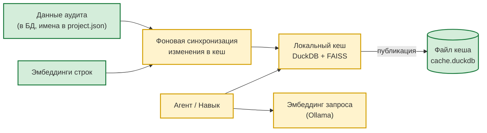
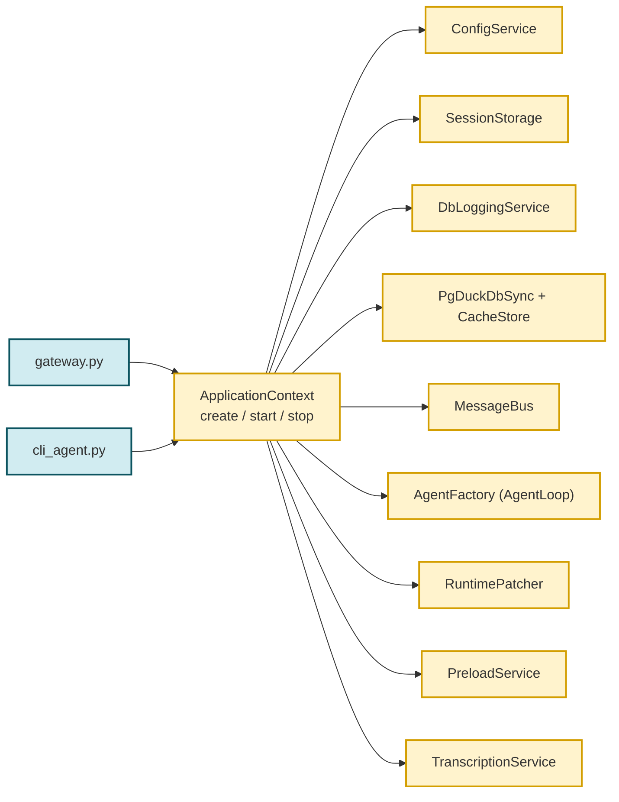
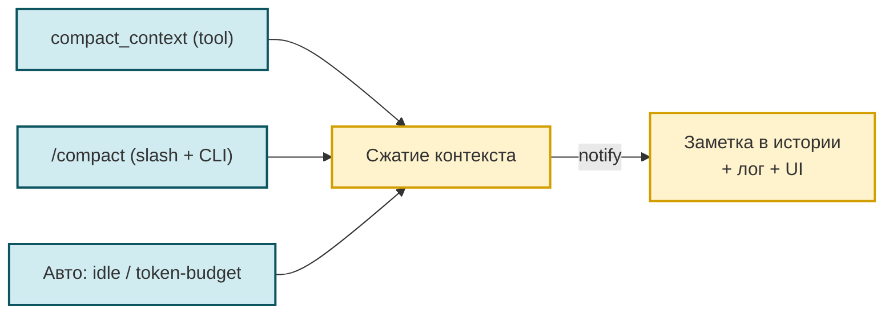
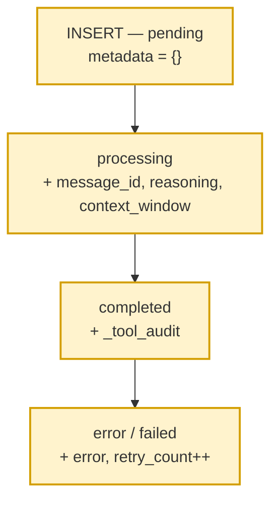

# 🏗 Архитектура и сервисный слой

> Навигационный индекс каталога `docs/` — в [`README.md`](README.md). Этот документ —
> самодостаточное описание подсистемы.
>
> **Это описание текущей реализации («as-is»).** Нормативная целевая архитектура
> (принципы, invariant'ы, anti-patterns, decision-чеклист) — отдельный контракт
> [TARGET_ARCHITECTURE.md](TARGET_ARCHITECTURE.md). Правила и «как должно быть»
> ищите там; здесь — только то, как оно работает сейчас.

## 🏗 Архитектура

Инфраструктура (DuckDB-кеш, векторные индексы, эмбеддинги) вынесена из навыка
в **универсальный слой** `lib/services` — он не завязан на предметную область
«аудит» и может переиспользоваться любым навыком. Навык `audit_analyzer` остался
тонким CLI: он конфигурирует провайдера из своих настроек и работает с ним
напрямую (без промежуточных обёрток-шимов).

> **Об именах таблиц и индексов.** Все имена таблиц/индексов, упомянутые ниже, —
> **не зашитые константы**, а значения текущей инсталляции, настраиваемые в
> `project.json`. Они могут отличаться в других развёртываниях. Ключи конфигурации:
> `channels.postgres.table_name` / `messages_table` / `meta_table` / `claims_table`,
> `skills.audit_analyzer.tables[*].name` / `vector_indexes[*].name`,
> `gateway.vector.index.storage_table` / `config_table` / `signature_table`,
> `logging.db.table_name` / `question_runs_table`,
> `benchmark.runs_table` / `results_table`. Точный список и дефолты — в
> [TARGET_ARCHITECTURE.md](TARGET_ARCHITECTURE.md) и [AGENTS.md](../AGENTS.md).



**Потоки данных**

- `gateway.py` — единственный владелец файла кеша навыка. `PgDuckDbSyncService`
  (worker-поток, единственное подключение к PG) инкрементально синхронизирует
  таблицы в `DuckDbCacheStore` (чисто in-memory DuckDB), а после каждого цикла
  `store.publish()` атомарно записывает снимок (temp + `os.replace`) в файл
  кеша навыка (`in_memory_cache_path`).
- Навык CLI (`predefined`/`sql`) — запросы выполняются по опубликованному кешу
  (или напрямую по PG, если кеш выключен). Создание/обновление кеша его не
  касается. Единый интерфейс бэкенда: `get_schema / query_sql / explain`.
- `--mode vector` — семантический поиск по FAISS-индексу: провайдер загружает
  индекс из `public.agent_vector_index_store` (BYTEA), при промахе пересобирает из
  `oarb.audit_vectors`, эмбеддинг запроса получает через Ollama.

---

## Сервисный слой (ApplicationContext + lib/)

После выделения сервисного слоя gateway и cli_agent сократились и вся инициализация вынесена в `ApplicationContext`
(см. подробности в `CHANGELOG.md`). Этот раздел — про
**внутреннее устройство** нового слоя, нужно при добавлении новых
сервисов или изменении lifecycle.

### Точки входа → общий bootstrap



### `lib/core/` (ApplicationContext + фабрики)

- **`application_context.py:ApplicationContext`** — единственный класс,
  собирающий все общие сервисы. Поля (помимо путей и конфига):
  `bus`, `agent`, `tool_audit_hook`, `hooks`, `session_manager`,
  `storage_mode`, `db_logging_service`, `sync_service`,
  `cache_store`, `config_service`, `runtime_patcher`,
  `transcription_service`, `subprocess_manager`, `preload_service`,
  `runtime_health`, `runtime_readiness`, `session_storage_service`,
  `hook_factories`, `project_settings`.
  Метод `start()` использует `ShutdownCoordinator` для регистрации
  сервисов; `stop()` — LIFO graceful shutdown.
  **Graceful degradation:** если БД недоступна, сервис остаётся `None`,
  gateway/cli работают без него (с предупреждением в логах).
- **`agent_factory.py:AgentFactory`** — `create(config, bus, session_manager=...,
  cron_service=..., db_logging_service=..., project_hooks=...)` → `(agent, hooks,
  hook_factories)`. `project_hooks` (плагины `workspace/hooks/`) ставятся
  ПЕРЕД `ToolAuditHook` в `hooks=`; агент создаётся ровно один раз.
  `DatabaseLoggingHook` подключается НЕ как общий инстанс, а как фабрика
  оборота (`make_db_logging_hook_factory` в `hook_factories=`) — фреймворк
  создаёт свежий инстанс на каждый оборот, изолируя состояние вопроса между
  конкурентными сессиями (см. `database_logging_hook.py`).
  Lazy-import `lib.hooks.database_logging_hook` через try/except
  (если модуль не подключён — фабрика просто не создаётся).
  Флаг `print_llm_calls` пробрасывается в фабрику оборота: при `True`
  хук печатает в терминал токены каждой LLM-итерации (включается всегда
  в CLI-режиме через `cli_agent.py`; в gateway — опцией
  `gateway.print_llm_calls`).
- **`bus_factory.py:BusFactory`** — `create()` возвращает `MessageBus`,
  опционально обернув `publish_inbound`/`publish_outbound` async-логгерами
  из `db_logging_bus.py`. **Без monkey-patch'ей**: оригинальные методы
  шины сохраняются в замыкании.

### `lib/services/`

Полный список модулей — см. раздел [«Структура проекта»](#структура-проекта) ниже. Здесь — только
**Новые**, с краткой мотивацией:

| Сервис | Мотивация (почему выделен) |
|--------|---------------------------|
| `config_service.py` | Дубликат `_load_runtime_config` + `SETTINGS`-аксессора между gateway и cli. Pre-resolve `${PROVIDER_API_KEY}` от .secrets.env (см. ниже). |
| `session_storage.py` | Выбор `PGSessionManager` / `SessionManager` (auto / postgres / file) с поддержкой `session_manager.json` override. |
| `runtime_patcher.py` | Все monkey-patch'и фреймворка в одном классе с fallback при изменении API nanobot: `ContextGovernor.normalize_tool_result` (persist больших результатов), `AgentLoop._save_turn` (архивация вместо усечения, см. «Ликвидация потери данных»), ограничения вывода exec/tool (`patch_exec_limits`/`patch_tool_limits`), `agent._assemble_outbound` (внедрение `_tool_audit`). |
| `channel_factory.py` | `ChannelManager` + Redis + Postgres каналы + транскрипция (вынесено из gateway). Конструктор принимает `print_worker_activity` (пробрасывается в `PostgresChannel` из `gateway.print_worker_activity`). |
| `transcription_service.py` | openai/groq key/URL/language (вынесено из gateway). |
| `subprocess_manager.py` | Streamlit spawn + terminate/kill. |
| `preload_service.py` | Только FAISS preload (`preload_vector_indexes`) для gateway. Legacy CLI-методы `preload_audit_cache` / `background_audit_cache_refresh` / `start_audit_cache_tasks` / `stop_tasks` удалены в `refactor/core-extract-duckdb-faiss`: единственный писатель DuckDB-снимка — `DuckDbCacheStore.publish()` через gateway; путь снимка вычисляется через единый `resolve_publish_path()` (`lib/core/application_context.py`) — default `~/.cache/nanobot/duckdb/cache.duckdb` или override `gateway.cache.local_path`. CLI/skill/vector_index_service вызывают ту же функцию, так что расхождение невозможно. |
| `db_logging_service.py` | **Новый** — структурированный журнал агента в `agent_gateway_logs` (имя настраивается через `logging.db.table_name`). |
| `db_logging_bus.py` | **Новый** — обёртки `publish_inbound`/`publish_outbound` для `DbLoggingService`. |
| `schema_formatter.py` | **Удалён** — internal service для формирования описания схемы БД. Использовался только `NlSqlRunner`'ом, который тоже удалён. Замена: skill `audit_analyzer` сам читает схему из `SKILL.md` (секция «Схема домена», см. `workspace/skills/audit_analyzer/SKILL.md`). |
| `nl_sql_runner.py` | **Удалён** — общая логика NL→SELECT pipeline. Заменена: CLI skill'а `audit_analyzer` — режим `--mode generated_sql` (`workspace/skills/audit_analyzer/scripts/generated_sql_mode.py`, прямой вызов `lib.services.llm_client.call_llm`), либо Agent формирует SQL сам (см. `SKILL.md` секция «SQL guidance»). |

### Pre-resolve `${VAR}` от `.secrets.env`

`nanobot._load_runtime_config` резолвит `${LLM_API_KEY}` только из
`os.environ` и при отсутствии падает `ValueError`. Между тем `config.py`
для провайдерских ключей использует провайдер-скоупинг формат
`.secrets.env`:

```
# providers: llm
api_key=XavGPsHjtNt3uOtFGUhabUuad5PRm2D0W
```

— в `os.environ` это не попадает как `LLM_API_KEY`. Решение
(`ConfigService._pre_resolve_env_refs`): прочитать `config.json`,
найти `${VAR}` плейсхолдеры, для каждого `*_API_KEY` без env — достать
ключ из `SETTINGS.providers.<любой>.api_key` (туда `config.py` уже
подставил значение) и положить в `os.environ` ДО `_load_runtime_config`.
**Gateway больше НЕ требует `export LLM_API_KEY=...` в shell.**

> **Миграция с исторического имени:** в старых конфигах `.secrets.env` мог
> быть `# providers: mistral`. Логика остаётся обратно совместимой: ключ
> из любой непустой секции `providers.*` подставляется как `LLM_API_KEY`.
> Достаточно переименовать секцию в `# providers: llm` для ясности.

### Единый резолв LLM-конфигурации: `lib/services/llm_config.py`

Резолв провайдера/модели/ключа вынесен в общий модуль
`lib/services/llm_config.py::resolve_llm_config()`: дефолт берётся из
`agents.defaults` (модель/провайдер) и `providers.<provider>`
(`apiBase`/`apiKey`) уже-резолвнутых `SETTINGS`, переопределения
(например, `skills.audit_analyzer.llm_*`) передаются через `overrides`.

Используется единообразно:
* навыком `audit_analyzer` — `scripts/skill_config.py::get_llm_config()`;
* бенчмарками — `benchmarks/runner.py::_run_suite()` (без хардкода
  провайдера при `--model`; `ensure_llm_env()` гарантирует
  `LLM_API_KEY` в env для резолва `${LLM_API_KEY}`).

Так смена модели/провайдера/ключа агента автоматически меняет LLM и в
навыке, и в бенчмарке — без дублирования секретов в трёх местах.

### Race-condition fix: callbacks ДО `ctx.start()`

`PgDuckDbSyncService` — worker-поток, который делает `initial_load` сразу
после `start()`. Если `set_on_new_records_callback(upsert_records)` ещё
не вызван к этому моменту, `_dispatch` скипает записи → DuckDB остаётся
пустым → `preload_vector_indexes` видит "нет данных" несмотря на
данные в `oarb.audit_vectors`. **Fix:** в `gateway.py:main()` callbacks
устанавливаются **ДО** `ctx.start()`. Тогда worker-тред при первом
`_do_initial_load` уже видит настроенные callbacks → `upsert_records`
вызывается → FAISS preload находит данные.

### Конкурентно-безопасное БД-логирование: per-turn инстанс `DatabaseLoggingHook`

Обороты разных сессий (вопросов) обрабатываются конкурентно
(`AgentLoop._dispatch` → `_concurrency_gate`, дефолт
`NANOBOT_MAX_CONCURRENT_REQUESTS=3`). Проблема: фреймворковый
`AgentRunHookContext` (для `after_run`) **не содержит `session_key`** —
контекст вопроса приходится хранить в самом хуке.

**Исторический баг:** один общий инстанс `DatabaseLoggingHook` на все
сессии, контекст в плоских полях (`_run_session_key`/`_request_id`).
При конкурентном переплетении оборотов чужой вопрос перезаписывал
поля между `before_`/`after_execute_tool`, и:
  * `log_tool_result` / `run_finished` получали request_id чужого вопроса;
  * `after_run` мог `finish_request`/`clear_request` чужую сессию.

**Решение — фабрика оборота.** `DatabaseLoggingHook` создаётся на
КАЖДЫЙ оборот через `make_db_logging_hook_factory(db_logging_service,
agent_id)` (`lib/hooks/database_logging_hook.py`). Фабрика получает
`AgentTurnHookContext` (там есть `session_key`), резолвит `request_id`
через `service.get_request_id(session_key)` и запекает оба значения в
конструкторе — состояние вопроса изолировано между сессиями, гонки нет.

`AgentFactory.create` передаёт фабрику в `AgentLoop` через
`hook_factories=[...]` (а не общий инстанс в `hooks=...`). `ToolAuditHook`
остаётся в `hooks=` — он bucket-безопасен по `session_key`.

`RuntimePatcher.patch_subagent_logging` использует тот же паттерн:
каждый `_SubagentLoggingHook` создаёт СВОЙ `_db_hook` на запуск
подагента (class-level shared `_db_hook` давал ту же гонку между
конкурентными субагентами).

Регрессионный тест: `tests/test_hooks_database_logging.py →
TestDatabaseLoggingHookFactory.test_concurrent_sessions_do_not_mix_request_id`
(переплетение двух сессий → `log_tool_result`/`after_run` несут свой
`request_id`).

### Единый конвейер sync-событий (`emit_sync_event`)

PG→DuckDB sync-путь пишет события (`sync_service_started`,
`sync_initial_load_done`, `sync_table_loaded`, `sync_publish_ok`/
`sync_publish_empty`/`sync_publish_failed`, …) в `agent_gateway_logs`
единым способом — через helper
`workspace.utils.event_log.emit_sync_event(event_type, summary, payload,
*, name, level, service)` (dual-sink):

1. если передан запущенный `service` (`DbLoggingService`) — событие
   идёт через пул-воркер (async, `timestamp` проставляется на flush);
2. иначе — синхронный fallback `event_log.record_sync_event` (прямой
   INSERT с `NOW()`): standalone-утилиты, ранние стадии старта, тесты,
   где `DbLoggingService` ещё не создан/не запущен.

Ошибки обеих веток глотаются — sync-код не падает из-за логирования.

`service` инжектится в оба писателя sync-конвейера при сборке в
`ApplicationContext._make_sync_services`:
`PgDuckDbSyncService(db_logging_service=...)` и
`DuckDbCacheStore(db_logging_service=...)` (publish-события из
worker-потока). В юнит-тестах store создаётся без сервиса →
автоматический fallback на `record_sync_event`.

**Зачем единый конвейер (историческая проблема).** Раньше события
писались двумя путями с разной семантикой времени: `DbLoggingService`
буферизовал батчи и проставлял `timestamp` на flush
(`flush_interval_sec=5`), а `DuckDbCacheStore._emit_sync_event` делал
прямой INSERT с мгновенным `NOW()`. Из-за этого
`sync_publish_ok` мог получить время РАНЬШЕ `sync_service_started` —
ложная хронология в журнале. После перевода всех sync-событий на
`emit_sync_event` хронология идёт одним потоком.

### Видимость «тихих» ошибок: preload векторов и канал

Общий принцип: проблемы, которые раньше молча проглатывались, должны
попадать в `agent_gateway_logs` (post-factum, `history_search`) и в
терминал gateway (мгновенно). Два источника «тихих» сбоев подняты на
этот уровень:

**1. FAISS-preload при старте** (`DuckDbCacheStore.preload_indexes`).
Раньше ошибка чтения списка source была беззвучной (`return []`), а
провал построения одного индекса — тихим `continue`: gateway печатал
dim-«нет данных в кэше», неотличимо от реального отсутствия данных.
Теперь `preload_indexes`:

* собирает ошибки в `self._preload_errors` (аксессор
  `preload_errors()`; сбрасывается при каждом вызове);
* пишет события `vector_preload_error` (ошибка чтения `source` из
  таблицы хранения, `index_name=None`) и `vector_index_build_failed`
  (ошибка построения конкретного индекса) через
  `_emit_sync_event(..., service=self._db_logging_service)` — в
  журнал, при `None` — standalone-fallback; дополнительно дублирует
  warning в терминал (`logger.warning`, stdlib-logging).
* `PreloadService.preload_vector_indexes` логирует
  `logger.warning` (loguru) при собственном исключении вместо тихого
  `None`;
* `gateway._preload_and_report` по `cache_store.preload_errors()`
  печатает красный список ошибок построения вместо/вместе
  dim-строки «нет данных».

**1.1. Health-summary declared vs runtime (vector index discovery)**.
До этого — даже при полностью diverged состоянии (объявил
новый индекс в `gateway.vector.index.indexes.*`, но не собрал blob
через `tools/build_vectors.py`) gateway **молча** показывал зелёный
«vector index … loaded» через fallback-цепочку
(`store → vdb → cache → files`), без какого-либо указания, что на
самом деле расхождение есть. Теперь `PreloadService.preload_vector_indexes`
после прогона считает явное расхождение между **declared** (JSON,
`project.json::gateway.vector.index.indexes.*`) и **runtime** (PG
`public.agent_vector_index_store`), классифицируя каждое имя
индекса в одну из категорий:

  * `missing` — объявлен в JSON, но не загружен / не найден в PG store;
  * `orphan` — blob в PG store, но не объявлен в JSON (мёртвые данные);
  * `stale` — blob есть, но signature не совпадает с текущим cfg
    (помечается как `STALE` или `INVALID`).

Сводка печатается в **stderr** (multi-line, без ANSI) и пишется в
`agent_gateway_logs` через `emit_sync_event` (event_type
`vector_index_preload_health`, level=`WARN` если есть divergence,
иначе `INFO`). Ошибки любого этапа (PG недоступна, config parse
failed) глотаются — summary **никогда** не валит startup gateway.

Чистая логика вычисления — в pure-функции `compute_index_health()`
в `preload_service.py`, отделена от I/O и эмита; тестируема без mock'ов
PG/JOBS.

**2. PostgresChannel — циклы опроса БД.** Ошибки
`poll_inbound`/`_poll_once`, `_lease_loop`, `_unstick_loop` раньше шли
только в `self.logger.error` (loguru, терминал). Теперь каждая
дублируется в `agent_gateway_logs` через метод `_journal_event`
(`PostgresChannel`), событие-типы `channel_poll_error` /
`channel_lease_error` / `channel_unstick_error` (payload:
`component`/`error_type`/`error`). `_journal_event` — no-op без
запущенного `DbLoggingService` (тесты/standalone пишут без сервиса);
внутренние ошибки журналирования глотаются.

`DbLoggingService` инжектится в `PostgresChannel` по цепочке:
`gateway._run` → `ChannelFactory(db_logging_service=ctx.db_logging_service)`
→ `create_all` → `PostgresChannel(config, bus, db_logging_service=...)`.

### Метрика занятости контекстного окна (`metadata.context_window`)

**Задача.** Видеть в UI, сколько процентов контекстного окна модели
занято финальным запросом — и обновлять это пока агент ещё думает
(живое обновление processing-строки), не дожидаясь конца оборота.

**Решение — три компонента + мост:**

1. **Мост per-iteration usage** (`lib/hooks/database_logging_hook.py`).
   Потокобезопасный словарь `_CONTEXT_BRIDGE: dict[str, dict]` под
   `threading.Lock`. Ключ = `session_key` (`postgres:<chat_id>`), чтобы
   конкурентные сессии не «перепутались». Публичные функции:
   * `seed_context_window(session_key, limit=, model=)` — патч на
     старте оборота кладёт лимит окна и модель (знает только агент).
   * `DatabaseLoggingHook.after_iteration` → `_store_iteration_usage`
     пишет СВЕЖИЙ по-итерационный `context.usage` (именно последняя
     итерация — то, что модель реально видела в финальном запросе).
   * `_store_context_window` — финальный готовый блок, его кладёт
     `_attach_context_window` (патч 2a).
   * `get_context_window(session_key)` — канал читает для live-update;
     предпочитает готовый блок, иначе собирает на лету из
     usage+limit.
   * `pop_context_bridge(session_key)` — анти-stale, чистится при
     `_finalize_turn` и `_mark_failed`.

2. **Патчи `RuntimePatcher`** (`lib/services/runtime_patcher.py`):
   * `patch_context_bridge_seed` (патч 2b) — оборачивает
     `agent._state_build`: на старте оборота сеет лимит/модель в мост
     (best-effort, ошибки не мешают обороте).
   * `_attach_context_window` в `_wrap` `_assemble_outbound` (патч 2a)
     собирает блок `{used: int, limit: int, pct: float (4 знака, clamp 0..1),
     model: str}` из usage последней итерации ÷ лимит окна и кладёт в
     `result.metadata["context_window"]`. Готовый блок дополнительно
     кладётся в мост для канала. Если мост пуст (DB-логирование
     выключено), фолбэк на `agent._last_usage` (сумма по итерациям —
     завышает, но лучше чем ничего).

3. **Живое обновление в канале** (`lib/channels/postgres_channel.py`):
   `_flush_live_context` в `_flush_reasoning_loop` (каждые
   `_flush_interval` секунд) читает `get_context_window(session_key)` и
   пишет блок в `metadata.context_window` processing-ассистент строки
   в БД. UI (Streamlit) видит его через свой поллинг
   `metadata.context_window` и рисует прогресс-бар, который
   заполняется «вживую» по мере роста промпта. После финализации
   оборота `_drop_context_bridge(chat_id)` снимает мост.

**Место хранения:** `metadata.context_window` в JSONB
`agent_conversation_messages` (S1). Без миграций: канал уже сливает
`metadata` целиком в `_finalize_turn`.

**UI:**
* **Streamlit** (`streamlit_app.py`): `_render_context_window(block)` —
  `st.progress(pct, text="Контекст: used / limit · NN% · model")`.
  Рисуется один раз для финальной строки (после загрузки истории)
  и live для processing-строки (каждый poll). Метка `metadata.kind ==
  "context_compact"` (ContextCompactionService) даёт отдельный стиль
  `.compact-notice`.
* **CLI** (`lib/cli/console_loop.py`): `_print_context_window(block)` —
  одна строка `[dim]📊 Контекст: used / limit · NN% · model[/dim]`
  после `_typewriter(content)`. Гейт `cfg.show_context_window`
  (по умолчанию `true`).

**Конфигурация** (`project.json`):
* `cli.show_context_window` (bool, дефолт `true`) — печатать в CLI.
  В `REQUIRED_KEYS` (`tests/test_config_keys.py`).

**Что не делается (явные «нет»):**
* Не суммируется usage по итерациям — `agent._last_usage` слишком
  завышает занятость на многоитеративных оборотах (токены
  накапливаются, но окно модели — снапшот последней итерации).
* Не рисуется в UI из `agent._last_usage` (только из моста) — иначе
  будет рассинхрон с финальным блоком.
* Нет auto-tighten окна (сжатие) — это задача
  `ContextCompactionService` (`lib/services/context_compaction.py`),
  отдельный поток.

**Тесты:** `tests/test_database_logging_bridge.py` (мост),
`tests/test_runtime_patcher.py::TestPatchContextBridgeSeed` (патч 2b),
`tests/test_postgres_channel.py::TestPostgresChannelContextWindow`
(live-update + drop), `tests/test_streamlit_app.py::TestRenderContextWindow`
(UI), `tests/test_console_loop.py::TestPrintContextWindow` (CLI).

### Управление сжатием контекста: `ContextCompactionService`

**Задача.** Дать пользователю и оператору видимый след любого сжатия
контекста диалога — и ручного (``/compact``, ``compact_context``),
и автоматического (idle, token-budget). Один и тот же формат,
один и тот же путь записи.

**Архитектура (один путь — три входа):**



**Точки входа:**

1. **Настоящая slash-команда ``/compact``** —
   `lib/commands/compact_command.py::cmd_compact`, регистрируется
   `RuntimePatcher.patch_compact_command` в `agent.commands`
   (`CommandRouter`), где это единственный путь, общий для всех каналов
   (postgres, streamlit, telegram). В `run()` зарегистрированные команды
   перехватываются **до** LLM (``_dispatch_command_inline`` /
   ``_state_command``), поэтому сжатие срабатывает детерминированно и
   безоговорочно, а не «по усмотрению» модели. Handler ставит
   ``FINAL_TURN_KEY="_final_turn"`` в outbound (см. «Воркеры не берут
   задачи»), зовёт ``svc.compact(session_key=ctx.key, idle=..., force=True)``.

2. **CLI-команда ``/compact``** (`lib/cli/console_loop.py::_run_cli_compact`).
   Приватный путь REPL: в `run_repl` после проверки `_is_exit_command`
   перехват ``if command == "/compact" or command.startswith("/compact ")``.
   Создаёт локальный `ContextCompactionService(agent, settings=None)`
   (в CLI нет `SETTINGS`, но `_write_history_notice` сам отключается —
   нет `channels.postgres.dsn`), зовёт
   ``svc.compact(session_key="cli:<chat_id>", force=True)``, печатает
   отчёт Rich-цветом (cyan/yellow). Флаги `idle` / `--idle` / `-i`
   допустимы для совместимости, поведение не меняют (``force=True``
   уже подразумевает жёсткое idle-сжатие).

3. **Tool ``compact_context``** (`workspace/tools/compact_context.py`),
   регистрируется `RuntimePatcher.patch_project_tools` в `apply_all`
   (см. `lib/services/runtime_patcher.py`). Параметры:
   `session_key: str | None` (по умолчанию — текущая из
   `current_request_session_key()`), ``idle: bool=False``, ``force: bool=True``.
   Пустой вызов ``compact_context({})`` (= ручная просьба пользователя)
   трактуется как ``force=True`` — жёсткое сжатие независимо от порога
   токенов (JSON-schema-дефолт nanobot не применяется, значение подставляет
   Python-сигнатура). Явный ``force=False`` возвращает в token-budget режим.

4. **Авто-сжатие** — обёртки `patch_compaction_tracking` в
   `runtime_patcher`:
   * `_wrap_auto_compact_archive` (`agent.auto_compact._archive`) —
     перед/после вызова замеряет `last_consolidated` и `tokens`,
     если курсор сдвинулся и `result` непустой — зовёт
     `svc.record_external_compaction(...)`.
   * `_wrap_maybe_consolidate_by_tokens`
     (`agent.consolidator.maybe_consolidate_by_tokens`) — то же:
     diff `last_consolidated` до/после; если сдвинулся — пишет
     заметку через `record_external_compaction`.

Ручной вход ``/compact`` имеет два обработчика одного слова: slash-команда
в ``CommandRouter`` (сетевые каналы) и перехват в REPL. Оба ставят
``force=True``.

**Семантика ``force``.** ``ContextCompactionService.compact(session_key, *,
idle=False, force=False, max_suffix=8)``: если ``idle or force`` — идёт
жёсткое усечение ``consolidator.compact_idle_session``, иначе — token-budget
``maybe_consolidate_by_tokens`` (пропустит сессию ниже ``consolidationRatio``).
``force=True`` выражает явное пользовательское действие (``/compact`` или
ручной вызов tool'а) и игнорирует порог токенов. Ручные пути (slash-команда,
CLI, пустой вызов tool'а) всегда ``force=True``; только явный
``force=False`` возвращает в token-budget режим.

**Оценка размера сессии.** ``_estimate`` зовёт нативный
``consolidator.estimate_session_prompt_tokens`` (может быть sync или async).
Если он бросил исключение — ``_estimate_fallback`` даёт грубую оценку по
``~4 символа = 1 токен`` из ``session.messages`` (chain-строка помечается
``[fallback]``), чтобы отчёт/логи не писали «0 токенов» при реальном размере
в десятки тысяч. Fallback-значение идёт и в ``tokens_before``/``tokens_after``,
и в заметку ``metadata.compact``.

**Единый путь записи.** Ручной запуск зовёт `compact()`, авто —
`record_external_compaction(...)`. Оба заканчиваются вызовом
`ContextCompactionService._notify(report)`:

```python
async def _notify(self, session_key, report):
    text = self.format_report(report)
    logger.info("Context compaction [{}] {}: archived={}, tokens {}→{}", ...)
    if self.print_to_terminal:
        Console().print(f"[dim]🗜️ {text}[/dim]")
    if self.notify_in_history:
        await self._write_history_notice(session_key, report)
```

`format_report`, loguru-строка и `_write_history_notice` — **общие**
для всех путей. Ручное и автоматическое сжатие неразличимы по
формату и по содержимому в БД/логах/консоли.

**Формат `format_report`** (`ContextCompactionService.format_report`):

Для ``archived > 0``:

```
<текст LLM-сводки (если есть)>

Итог: заархивировано N сообщений (осталось K), BEFORE → AFTER токенов (экономия ≈P%).
```

Для ``archived == 0`` (сжатие не потребовалось):

```
Сжатие сессии «<key>» не потребовалось: контекст уже в пределах бюджета (N токенов).
```

Для ошибки:

```
Сжатие не выполнено: <причина>
```

**Что пишется в `agent_conversation_messages`:**

| Поле | Значение |
|---|---|
| `chat_id` | из `session_key` (`postgres:<chat>` или `streamlit:<chat>`) |
| `role` | `assistant` |
| `status` | `completed` |
| `content` | результат `format_report(report)` (полный текст) |
| `metadata.kind` | `context_compact` (метка для UI/аналитики) |
| `metadata.compact` | весь `report` (archived_msgs, kept_msgs, tokens, summary, mode) |

Поддерживаются **только** префиксы `postgres:` и `streamlit:` — это
единственные каналы с таблицей обмена. Для CLI-сессий (`cli:`)
запись пропускается: REPL сам показывает отчёт в терминале, в БД
идти нечему.

**Почему `agent_conversation_messages`, а не `agent_session_messages`:**
контекст промпта строится из `PGSessionManager` (таблица
`agent_session_messages`). Если бы заметка попадала туда — она бы
съедала токены, которые сжатие только что освободило. Заметка
видна в чате, но не загружается в LLM-промпт.

**Конфигурация** (`project.json` → `gateway.compact.*`, все ключи
опциональны, дефолты прямо в коде):

| Ключ | Дефолт | Эффект |
|---|---|---|
| `gateway.compact.enabled` | `true` | Регистрировать tool `compact_context`, slash-команду `/compact` и обрабатывать `/compact` в CLI. При `false` патчи пропускаются, все пути возвращают «отключено». |
| `gateway.compact.notify_in_history` | `true` | Писать заметки в `agent_conversation_messages` (ручные и авто). |
| `gateway.compact.print_to_terminal` | `false` | Дублировать отчёт в Rich-вывод gateway (по образцу `print_worker_activity`). |

На уровне nanobot (`config.json`) поведение сжатия управляется
стандартными ключами `consolidationRatio` (дефолт `0.5`) и
`idleCompactAfterMinutes` (в этом проекте `0` — auto-compact idle
выключен; см. `nanobot/config/schema.py:151-163`). См. также
**[Конфигурация навыка](DATABASE.md#конфигурация-навыка)** и
**[Структура проекта](#структура-проекта)**.

**Защита от `list_sessions`-шторма при выключенном idle-компакте**
(`runtime_patcher.patch_auto_compact_idle_guard`): `AgentLoop.run` при
отсутствии входящих раз в секунду зовёт `AutoCompact.check_expired()`
(`nanobot/agent/loop.py:1034`), а тот даже при `idleCompactAfterMinutes=0`
делает `sessions.list_sessions()` — дорогой N+1 (перечисление всех сессий +
отдельный запрос превью каждой). При сотне сессий это ~150 запросов/сек
вхолостую. Патч при `auto_compact._ttl <= 0` заменяет `check_expired` на
no-op — сбрасывая load практически до нуля (остаётся только легитимный
поллинг каналов). При `ttl > 0` патч пропускается.

**UI:**

* **Streamlit** (`streamlit_app.py`):
  * `_load_chat_history` поднимает флаг `compact_notice=True`, если
    `metadata.kind == "context_compact"`.
  * В рендере (строка ~290): ``<div class="compact-notice">🗜️ {content}</div>``
    через CSS-стиль — жёлтый фон, левая полоска `#f0c040`,
    мелкий шрифт, отступы. Не путается с обычными
    assistant-сообщениями.
* **CLI** (`lib/cli/console_loop.py`): `_run_cli_compact` печатает
  через Rich: `[cyan]🗜️ {text}[/cyan]` при успехе, `[yellow]🗜️ ...`
  при ошибке.
* **Терминал gateway** (`lib/services/context_compaction.py`):
  если `print_to_terminal=true`, Rich-вывод `[dim]🗜️ {text}[/dim]`
  (по образцу `print_worker_activity`).
* **loguru**: всегда пишется INFO-строка вида
  `Context compaction [token] postgres:streamlit: archived=12, tokens 34500→12300`
  (и аналогично для авто — `Auto context compaction [idle] ...`).

**Что не делается (явные «нет»):**

* Не добавляются служебные сообщения в `session.messages` при
  ручном `/compact` — это намеренно: иначе освобождённые токены
  сразу бы съела новая запись в истории. Состояние сессии
  (`last_consolidated`, `_last_summary`) правит штатный
  `Consolidator` nanobot (`memory.py::_persist_last_summary`),
  а наш сервис лишь пишет UI-заметку.
* Не отправляется пользователю уведомление через cron/heartbeat —
  сжатие не требует реакции.
* Не суммируется экономия по сессиям в отдельную таблицу — для
  аудита достаточно `metadata.compact` в `agent_conversation_messages`
  и loguru-логов.

**Безопасность:** вся блокировка уже внутри консолидатора
(`Consolidator.get_lock(session_key)`) — параллельные сжатия одной
сессии serialized. Обёртки `runtime_patcher` не добавляют
синхронизации и не делают двойных вызовов.

**Тесты:** `tests/test_context_compaction.py` (41 тест):

* `TestFormatReport` — формат отчёта: failure, idle-no-archive,
  with-archive+summary, summary-truncation, summary-`nothing`-marker,
  archive-no-summary.
* `TestEstimateFallback` — `_estimate_fallback` по символам, пустые
  сообщения, использование fallback, когда нативный метод падает.
* `TestCompact` — ручной путь: disabled-failure, missing-session-key,
  token-compaction-archives-and-reports, idle-mode, idle-no-archive,
  compactor-failure, session-state-relies-on-nanobot-consolidator,
  no-extra-message-in-session.
* `TestCmdCompact` — `cmd_compact` (slash-команда): возвращает
  `OutboundMessage` с `_final_turn`, всегда `force=True`, парсит `idle`,
  почитает `enabled=false`, прокидывает `settings` через `partial`.
* `TestCompactContextTool` — `CompactContextTool.enabled`/`create`/`execute`
  (стандартный nanobot-паттерн, читает `gateway.compact.*` через
  `ctx._settings_ref`).
* `TestCompactContextToolRegistered` — `patch_project_tools` реально
  регистрирует `compact_context` в `agent.tools`.
* `TestRecordExternalCompaction` — единый путь записи:
  `_write_history_notice` зовётся с правильным report,
  skip при `archived=0`, skip при `notify_in_history=false`.
* `TestPatchCompactionTracking` — `patch_compaction_tracking`:
  skip при `enabled=false` / `notify_in_history=false`,
  archive-wrapper зовёт `record_external_compaction`,
  skip когда авто не архивирует,
  maybe-consolidate-wrapper зовёт `record_external_compaction`.

#### Переопределение шаблонов nanobot: `workspace/overrides/`

`lib/services/consolidator_locale.py` подкладывает каталог `workspace/overrides/`
в Jinja2-loader шаблонов nanobot на старте приложения (`ApplicationContext.start()`),
поэтому любой системный промпт можно переопределить без правки пакета.

**Механизм.** `nanobot.utils.prompt_templates._environment()` кэшируется
`@lru_cache` и возвращает один и тот же `Environment`; `apply_template_overrides()`
меняет у него `loader` на `ChoiceLoader`, который сначала ищет файл в
`workspace/overrides/`, затем в штатных `templates/`. Мутация того же объекта
видна всем `render_template(...)`, патчить функцию не нужно. Идемпотентен;
при отсутствии каталога — no-op (используются штатные шаблоны).

**Правило размещения.** Файлы кладутся под
`workspace/overrides/<имя шаблона, как оно передаётся в render_template>`,
например `workspace/overrides/agent/consolidator_archive.md` переопределяет
`agent/consolidator_archive.md`.

**Сейчас в `workspace/overrides/`:**

* `agent/consolidator_archive.md` — русскоязычная инструкция Consolidator
  (базовая часть шаблона + правило «пиши факты на языке диалога»). Без него
  Consolidator извлекал бы факты на английском даже из русских диалогов.
  Это делает его единственным источником инструкции для
  `Consolidator.compact_idle_session` / `maybe_consolidate_by_tokens`
  (render `nanobot/agent/memory.py` при каждом сжатии).

**Тесты:** `tests/test_consolidator_locale.py` — приоритет override-файла,
fallback на штатный шаблон при отсутствии файла, идемпотентность, no-op при
отсутствии каталога, корректный путь по умолчанию.

#### `metadata` JSONB в `agent_conversation_messages`: полный справочник

`metadata` — JSONB-колонка таблицы обмена. Это **основной канал
передачи сервисных данных от бэкенда к UI** (помимо `content`,
`media`, `buttons`, `reply_to`). Любой UI, читающий
`agent_conversation_messages`, может отличить служебные записи
от обычных диалоговых по `metadata.kind`.

DDL: `metadata JSONB DEFAULT '{}'::jsonb` (см.
`sql/channels/create_public_agent_conversation_messages.sql`).
Чтение — `_decode_jsonb(metadata)` (из `utils.jsonb`).

##### 1. Жизненный цикл `metadata` одной строки

Одна строка проходит несколько фаз, в каждой из которых
`metadata` дополняется:



То есть в `metadata` **накапливаются** ключи от разных подсистем;
UI читает то, что есть, и не обязан понимать каждый ключ.

##### 2. Все ключи `metadata` — таблица

| Ключ | Тип значения | Где создаётся | Где обновляется | Удаляется? | Назначение |
|---|---|---|---|---|---|
| `kind` | `str` | `ContextCompactionService._write_history_notice` | — | никогда | Маркер «служебная заметка». Сейчас единственное значение — `"context_compact"`. Используется UI для условного рендера. |
| `compact` | `dict` | `ContextCompactionService._write_history_notice` | — | никогда | Словарь со статистикой сжатия. Только при `kind == "context_compact"`. См. подсекцию ниже. |
| `message_id` | `str` (UUID) | `PostgresChannel._poll_once` (в `meta` для assistant-placeholder) | — | никогда | ID user-сообщения, на которое это assistant-сообщение — ответ. Пара `message_id ↔ answer_id` (взаимные ссылки в соседних строках). |
| `answer_id` | `str` (UUID) | `PostgresChannel._poll_once` (в `meta` для user-строки) | — | никогда | ID assistant-placeholder, созданного сразу при клейме. Позволяет каналу находить строку для обновления. |
| `session_key` | `str` | Передаётся в `raw_meta` (UI/внешний клиент) | — | никогда | Полный ключ сессии nanobot, формат `<channel>:<chat_id>`. Если не передан в raw_meta, канал подставляет `f"postgres:{chat_id}"` (см. `postgres_channel.py:718`). |
| `retry_count` | `int` | `PostgresChannel._reclaim_and_heal` / `_mark_failed` | инкрементируется при каждом `error`/`stuck` | никогда | Сколько раз задача была в `error`. При `>= max_stuck_retries` → `failed`. |
| `error` | `str` | `PostgresChannel._mark_failed` | — | никогда | Только в строках со статусом `error` или `failed`. Краткое описание причины: `"dispatch_error"`, `"write_error"`. |
| `reasoning` | `str` | `PostgresChannel._flush_reasoning` (live) + `_finalize_turn` (atomic append) | дописывается через `_reasoning_io_lock` | никогда | Полный текст рассуждений модели (chain-of-thought). Может быть очень длинным. |
| `context_window` | `dict` | `PostgresChannel._flush_live_context` (live) | перезаписывается каждые `_flush_interval` сек | никогда | Метрика занятости контекстного окна: `{used: int, limit: int, pct: float (0..1, 4 знака), model: str}`. См. подсекцию «Метрика занятости контекстного окна» выше. |
| `_tool_audit` | `list[dict]` | `RuntimePatcher.patch_assemble_outbound` (финальный outbound) | — | никогда | Массив записей вызовов инструментов за оборот. Рендерится в UI (Streamlit) и CLI. |

**Не пишется в `metadata`:** `_final_turn` (флаг протокола канала,
в БД не пишется как значимое поле), `latency_ms` (для логов).

##### 3. `raw_meta` от UI (что кладёт источник)

Когда внешний клиент (Streamlit, REST, Telegram-бот) пишет
**новое** user-сообщение, он может положить любые поля в `metadata`
INSERT-а. Канал их читает и мерджит с собственными ключами:

```python
# postgres_channel.py:711-716
raw_meta = _decode_jsonb(row["metadata"])
# ...
meta: dict[str, Any] = {
    "message_id": user_msg_id,
    "answer_id": assistant_msg_id,
    **raw_meta,
}
```

**Конвенция** для `raw_meta` от UI: только поля, описывающие
маршрутизацию. Сейчас в проекте используется `session_key`
(потенциально; Streamlit-INSERT не пишет `metadata` — DEFAULT `'{}'`).
Любые `kind`/`compact`/`reasoning`/`context_window` от UI
**игнорируются** (будут перезаписаны каналом/патчами на следующих
стадиях жизненного цикла).

Пример валидного `raw_meta` для внешнего клиента:
```json
{"session_key": "telegram:123456", "client_meta": {"thread": "..."}}
```

##### 4. Кто пишет и когда

| Источник | Файл | Когда | Что пишет в `metadata` |
|---|---|---|---|
| UI (INSERT) | `streamlit_app.py:567` и аналоги | при отправке user-сообщения | `raw_meta` (опционально, `session_key` и прочее) |
| `PostgresChannel._poll_once` | `lib/channels/postgres_channel.py:758` | при клейме задачи | `message_id` (в assistant-строке), `answer_id` (в user-строке) |
| `PostgresChannel._flush_reasoning` | `postgres_channel.py:530` | live, каждые `_flush_interval` сек | `reasoning` (дописывается) |
| `PostgresChannel._finalize_turn` | `postgres_channel.py:1156` | на `_turn_end` | `reasoning` (atomic append остатков) |
| `PostgresChannel._flush_live_context` | `postgres_channel.py:560-570` | live, каждые `_flush_interval` сек | `context_window` (перезаписывается) |
| `PostgresChannel._reclaim_and_heal` | `postgres_channel.py:347-348` | lease-loop, истёк lease | `retry_count++` (затем `status='error'` или `'failed'`) |
| `PostgresChannel._mark_failed` | `postgres_channel.py:835-836` | ошибка диспетчера/записи | `retry_count++`, `error=<reason>` |
| `RuntimePatcher.patch_assemble_outbound` | `lib/services/runtime_patcher.py:730, 722, 96` | на финальном outbound | `_tool_audit` (если есть), `_final_turn: true` (внутренний протокол), `context_window` (если есть) |
| `ContextCompactionService._write_history_notice` | `lib/services/context_compaction.py:332` | после успешного сжатия (ручного или авто) | `kind: "context_compact"`, `compact: {…}` |

##### 5. Маркер `metadata.kind` — версионирование служебных заметок

`metadata.kind` — **точка расширения**: если в будущем добавятся
другие типы служебных заметок (например, `metrics_summary`,
`compaction_failure`, `tool_error_highlight`), они идут по тому же
контракту:

```json
{"kind": "<type>", "<type>": {<payload>}, "...": "..."}
```

**Конвенция:**

* `kind` — короткая строка-идентификатор, `lower_snake_case`.
* `<type>` (то же имя в `payload` ключе) — основной машино-читаемый
  блок.
* `content` строки — уже отформатированный человеком текст для
  показа. UI может рендерить **только** `content` без чтения payload.
* Для UI-клиента: `if metadata.get("kind") == "X": render_special()`
  иначе обычное сообщение.

**Версионирование:** при изменении формата payload — менять `kind`
на `<type>_v2`. Старые записи остаются с `kind = "<type>"` для
обратной совместимости. UI читает обе версии.

**Сейчас единственное значение `kind` — `"context_compact"`.**

##### 6. `metadata.compact` — payload для `kind == "context_compact"`

Только при `kind == "context_compact"`. Записывается
`ContextCompactionService._write_history_notice` после успешного
ручного или автоматического сжатия.

| Поле | Тип | Описание |
|---|---|---|
| `session_key` | `str` | Полный ключ сессии (например, `postgres:streamlit`) |
| `mode` | `"token"` \| `"idle"` | Режим: token-budget (`maybe_consolidate_by_tokens`) или idle (`compact_idle_session`) |
| `ok` | `bool` | `true` если сжатие успешно |
| `archived_msgs` | `int` | Сколько сообщений заархивировано (≥ 1 для записи) |
| `kept_msgs` | `int` | Сколько сообщений осталось в сессии |
| `tokens_before` | `int` | Размер промпта до сжатия (estimated) |
| `tokens_after` | `int` | Размер промпта после сжатия (estimated) |
| `summary` | `str \| null` | Текст LLM-сводки (если был; при `raw_dump=true` — отсутствует) |
| `raw_dump` | `bool` | `true` если LLM-саммарайзер упал, сделана raw-выгрузка без сводки |

**Правила:**

* `archived_msgs > 0` — иначе заметка **не пишется** (нет смысла).
* `metadata.compact.session_key` есть, даже если в `content` не упомянут.
* Для UI-клиента: `pct = (1 - compact.tokens_after / compact.tokens_before) * 100`
  — процент экономии.

##### 7. Примеры UI-логики

**Streamlit** (`streamlit_app.py`) — три места с условным рендером:

```python
# _load_chat_history (строки 89, 96, 100)
if metadata.get("kind") == "context_compact":
    msg_entry["compact_notice"] = True
if isinstance(metadata.get("context_window"), dict):
    msg_entry["context_window"] = metadata["context_window"]
if role == "assistant" and metadata.get("reasoning"):
    msg_entry["reasoning"] = metadata["reasoning"]

# _check_response (строка 157-159) — для одного ответа
metadata = _decode_jsonb(row["metadata"])
result = {"content": row["content"] or "", "metadata": metadata, "media": media}

# _get_processing_state (строки 175-177) — для live-обновления
meta = _decode_jsonb(row["metadata"])
return {"content": ..., "reasoning": meta.get("reasoning", "")}
```

UI читает **только** то, что знает (`reasoning`, `context_window`,
`kind`/`compact_notice`). Не знакомые ключи просто игнорируются.

**React/Telegram-бот — минимальный рендер `kind`:**

```tsx
{msg.metadata?.kind === "context_compact" ? (
  <div className="compact-notice">
    <span>🗜️</span>
    <span>{msg.content}</span>
    {msg.metadata.compact.archived_msgs > 0 && (
      <span className="badge">
        -{Math.round(
          (1 - msg.metadata.compact.tokens_after /
               msg.metadata.compact.tokens_before) * 100
        )}%
      </span>
    )}
  </div>
) : (
  <div className="message">{msg.content}</div>
)}
```

```python
# Telegram-бот
if row["metadata"].get("kind") == "context_compact":
    compact = row["metadata"].get("compact", {})
    pct = (1 - compact.get("tokens_after", 0) /
                max(compact.get("tokens_before", 1), 1)) * 100
    await bot.send_message(
        chat_id,
        f"🗜️ {row['content']}\n\n_экономия ≈{pct:.0f}%_",
        parse_mode="Markdown",
    )
else:
    await bot.send_message(chat_id, row["content"])
```

**Стиль в Streamlit** для `compact_notice`:

* CSS-класс `.compact-notice` — жёлтый фон `#fff8e1`,
  левая полоска `#f0c040`, мелкий шрифт, скругления. Определён в
  `<style>` блоке.
* В `_load_chat_history` поднимается флаг `compact_notice=True`.
* В цикле рендера — отдельный HTML-блок
  `<div class="compact-notice">🗜️ {content}</div>` через
  `st.markdown(..., unsafe_allow_html=True)`. Без акцента текст
  заметки читаем, но визуально сливается с обычными ответами.

##### 8. Что НЕ делается (явные «нет»)

* **Нет глобальной схемы** — `metadata` это JSONB, схема **описывается
  в коде и в этой документации**, а не в DDL. Дрейф возможен —
  при появлении нового ключа обновляйте эту секцию.
* **Нет валидации** на стороне записи — UI может положить любые
  поля в `raw_meta` (см. §3), но канал/патчи перезапишут конфликтующие
  ключи своими значениями.
* **`_final_turn` в БД не сохраняется** — это флаг протокола
  (`OutboundMessage.metadata["_final_turn"] = True`), используется
  каналом для решения «merge vs finalize». При записи в БД он
  не несёт полезной нагрузки и не документируется как часть
  контракта.
* **Заметка `kind == "context_compact"` не сортируется отдельно** от
  обычных сообщений — она появляется в `created_at` хронологии,
  как любой `assistant`-ответ. Если UI хочет группировать
  «последний сжатый ответ отдельно» — это на стороне UI.
* **Заметка `kind == "context_compact"` не фильтруется по `role`**
  — она `assistant`, как обычные ответы. UI, которые ограничивают
  `role IN ('user', 'assistant')`, покажут её автоматически.

##### 9. Совместимость и обратная совместимость

* Если `metadata` не содержит ключа, который UI ожидает — UI должен
  обрабатывать отсутствие (`metadata.get("X")` / `?.` / `metadata?.X`).
* `metadata.reasoning` может быть очень длинным — UI может рендерить
  свёрнутым `<details>` (как делает Streamlit).
* `metadata.context_window.pct` уже clamp 0..1, 4 знака — можно
  умножать на 100 сразу, не нормализуя.
* `metadata.compact.tokens_before/after` — `0` допустимо (если
  замер не удался, `_estimate` вернул `(0, "")`); UI должен делить
  осторожно (`max(compact.tokens_before, 1)` для pct).
* Старые строки в `agent_conversation_messages` без `metadata.kind`
  — это нормально, читается как `null` → рендер как обычное сообщение.

##### 10. Тесты

* `tests/test_postgres_channel.py::TestPostgresChannelReasoning` —
  `reasoning` live + atomic append в `_finalize_turn`.
* `tests/test_postgres_channel.py::TestPostgresChannelContextWindow` —
  `context_window` live-update + drop.
* `tests/test_streamlit_app.py::TestRenderContextWindow` —
  UI-рендер `context_window`.
* `tests/test_console_loop.py::TestPrintContextWindow` —
  CLI-рендер `context_window`.
* `tests/test_context_compaction.py` — запись `kind == "context_compact"`,
  `compact`-payload, skip-правила.
* `tests/test_runtime_patcher.py::TestPatchAssembleOutbound` —
  внедрение `_tool_audit` в `metadata`.

### Ликвидация потери данных при усечении больших результатов инструментов

**Проблема.** Результаты больших инструментов терялись на нескольких уровнях:

1. **exec/shell**: nanobot режет вывод команды до
   `MAX_OUTPUT_CHARS = 50K` символов и вставляет маркер
   `... (19,761 chars truncated) ...` (`nanobot/agent/tools/shell.py`,
   `exec_session.py`), отбрасывая середину. Persist потом сохраняет
   «голову+хвост» — данные теряются безвозвратно.
2. **История сессии**: `AgentLoop._save_turn` усекает строковый результат
   инструмента до `max_tool_result_chars = 16K` символов, если результат не
   ушёл в persist раньше (в первую очередь это `read_file`).
3. **Вторичные инструменты** (`read_file`/`grep`/`list_dir`) имеют свои
   потолки с маркерами `truncated`.

**Решение (все уровни закрыты патчами `RuntimePatcher`):**

| Патч | Что делает |
|------|-----------|
| `patch_exec_limits` | Поднимает `MAX_OUTPUT_CHARS` (дефолт 500K), `DEFAULT_MAX_OUTPUT_CHARS` (100K), `ExecTool._MAX_OUTPUT`, а также подменяет `maximum` в JSON-Schema параметра `max_output_chars`/`max_output_tokens` (модель может запросить вывод >50K). Безопасно для контекста: вывод exec не exempt в persist → >`persist_threshold` уходит полным файлом в `data_store`, в контекст — ссылка. |
| `patch_tool_limits` | Поднимает `ReadFileTool._MAX_CHARS` (512K), `search._DEFAULT_HEAD_LIMIT` / `_DEFAULT_FILE_HEAD_LIMIT` (500/400), `GrepTool._MAX_FILE_BYTES` (20MB), `ListDirTool._DEFAULT_MAX` (500). |
| `patch_save_turn` | Оборачивает `AgentLoop._save_turn`: любой большой результат `role == "tool"` (строка или JSON-сериализуемый список) пишется **полным** файлом в `data_store` через `SessionFileStore` (суффикс `__<hash>` — dedupe), в историю кладётся ссылка `[Result saved to data_store/<path> (<size> KB)]` — тот же формат, что кастомный persist. Оригинальный `_save_turn` вызывается с копией сообщений, логика nanobot не дублируется. |
| `save(..., dedupe=True)` | Новый параметр `SessionFileStore.save`: повторное сохранение того же содержимого (sha1, первые 12 hex) возвращает уже существующий файл (`deduped=True`), чтобы повторные/конкурентные обороты не плодили копии. |

**Конфигурация** — `gateway.tool_result_limits` в `project.json`
(все ключи опциональны, дефолты в коде):

```jsonc
"tool_result_limits": {
  "exec_max_output_chars": 500000,
  "exec_default_output_chars": 100000,
  "read_file_max_chars": 512000,
  "grep_head_limit": 500,
  "grep_file_head_limit": 400,
  "grep_max_file_bytes": 20000000,
  "list_dir_max_entries": 500
}
```

**Fallback-поведение**: каждый патч в try/except; при изменении API nanobot —
`(False, <причина>)` в `PatchReport`, процесс не падает. `_save_turn`-обёртка
при `OSError` в persist грейсит — вызывает оригинал (поведение «как раньше»).
`read_file` остаётся exempt в `normalize_tool_result` (избегаем
read→persist→read петли).

**Реальные проверки** — `tests/test_runtime_patcher_e2e.py` (9 тестов):
настоящий `ExecTool` исполняет команду с выводом >лимита и проверяет
отсутствие маркера `chars truncated` после патча; настоящий `ReadFileTool`
читает файл >дефолтного потолка целиком; `_save_turn`-обёртка и
`ContextGovernor.normalize_tool_result` пишут **полные** файлы на диск в
`data_store/` и подменяют историю ссылкой. Каждый тест сам восстанавливает
состояние фреймворка в `finally`.

---

## Сервисный слой (MessageExchange + LLM-клиент + утилиты)

Этот раздел добавляет поверх сервисного слоя набор общих модулей, чтобы
устранить дрейф поведения между каналами, навыками и CLI-инструментами.

### `lib/channels/message_exchange.py` — общий движок каналов

`MessageExchange` — единая точка кодирования/декодирования `InboundMessage` /
`OutboundMessage`, поллинга и публикации outbound, фильтрации служебных
сообщений. `PostgresChannel` и `RedisChannel` — тонкие обёртки над ним,
`streamlit_app.py` использует тот же движок для чтения истории. Запрещено
дублировать логику polling/encoding в новых каналах — только через
`MessageExchange`.

Зависимости модуля:
- `workspace/utils/media.py` — кодек media (AW-формат `{filename, file_id, mime_type,
  file_size}` + обратная совместимость со старым `{filename, data}` и
  data-URL).
- `workspace/utils/jsonb.py` — JSONB-декодер media для PG.
- `lib/utils/outbound_meta.py` — единый фильтр служебных outbound
  (`system`, `audit`, `tool_audit`, `_assemble_outbound`-артефакты).
- `SessionFileStore` (`workspace/utils/session_file_store.py`) — общий стор
  вложений под `data_store/cache/sessions/<key>/attachments/`.

При добавлении нового канала: наследовать `nanobot.channels.base.BaseChannel`
и делегировать `start/stop/send/send_delta/poll_once` в `MessageExchange`.
Подробнее — [`../lib/channels/README.md`](../lib/channels/README.md).

### Мульти-машинный пул воркеров (аренда задач через `agent_worker_claims`)

`PostgresChannel` разворачивается на нескольких машинах как полный gateway,
читающий одну таблицу `public.agent_conversation_messages`. Чтобы одна задача
(сообщение веб-чата) физически не обрабатывалась двумя воркерами, введена
таблица аренд `public.agent_worker_claims` (`sql/workers/`, DDL — см.
`sql/README.md`). Эксклюзивность гарантирует **UNIQUE PK `(task_id)`, а не
MVCC/`UPDATE ... WHERE status='pending'`**: два `INSERT` с одним `task_id`
невозможны, второй падает на unique-индексе.

**Инвариант:** `status='processing' ⇔ существует ровно одна claim-запись с
живым lease` для этого `task_id`.

**Статусы задач:**

| Статус | Значение | Повторяется? |
|---|---|---|
| `pending` | готова к обработке | да, сразу |
| `processing` | в работе воркера (держит claim) | нет — защищена lease |
| `error` | повторяемая ошибка | да, после `error_retry_delay` |
| `failed` | терминальный (не меняется) | нет — окончательно |
| `completed` | успешно завершена | — |

`error` и `failed` разведены: `error` (retry-каунтер в `metadata.retry_count`
не исчерпан) возвращается в пул после паузы; `failed` — immutable-терминал.
Раньше обе ситуации сводились к `failed`, и web-клиент ждал оконное время на
«появление в работе», которое могло никогда не наступить.

**Клейм (`_claim_one`) — одна транзакция:**
1. `SELECT` самого старого кандидата (`pending` или `error` с истёкшим
   backoff) без активного claim и из чата без активной `user`-задачи
   (`status='processing'`);
2. `INSERT INTO agent_worker_claims ...` — арбитр эксклюзивности; при
   `UniqueViolation` транзакция откатывается и выбирается следующий кандидат;
3. `UPDATE messages SET status='processing'` — владелец задачи живёт только
   в `agent_worker_claims.worker_id`, колонка в сообщениях не используется.

**Lease и heartbeat:** срок аренды = `processing_timeout`. Фоновая задача
`_lease_loop` каждые `lease_interval` продлевает `lease_until` своим арендам и
запускает `_reclaim_and_heal`. Это **единственный** источник reclaim/heal —
из горячего пути опроса (`poll_inbound`) транзакция убрана, чтобы не гонять
4 UPDATE/DELETE на каждом тике `poll_interval`. Перед запуском
`_reclaim_and_heal` `_lease_loop` проверяет быстрый гейт `_reclaim_needed`
(есть ли хоть одна `processing`-строка или хоть один claim): на пустом столе
транзакция пропускается целиком (ред. один `SELECT ... EXISTS` на тик).

**`_reclaim_and_heal` (одна транзакция):**
1. `DELETE FROM claims WHERE lease_until < NOW()` — «мёртвый» воркер
   освобождает задачи: задача → `pending` (или `failed` при исчерпании
   `max_stuck_retries`), assistant-placeholder удаляется;
2. `processing`-без-claim → `error` (аномалия, повторится после backoff);
3. orphaned assistant-placeholder (без user-пары) → `failed`;
4. висячая аренда (claim есть, а задача не в `processing`) — удаляется.

**Освобождение аренды:** `send()` (только на финальном outbound) /
`send_delta(stream_end)` / `_mark_failed` удаляют claim в той же транзакции,
что и запись `completed`/`error`/`failed`. `stop()` возвращает незавершённые
задачи в пул (`_release_all_leases`).

**Промежуточные публикации тула `message(...)` vs финал оборота.**
`MessageTool` в nanobot публикует свой outbound через шину **в момент
исполнения тула**, т.е. до завершения оборота. `send()` финализирует оборот
(claim + слот + `_msg_ctx`) **только** на маркере `metadata["_final_turn"]`
(или legacy `_turn_end` / `latency_ms`), который ставит патч
`RuntimePatcher.patch_assemble_outbound` (при подавленном финале — синтетическим
outbound). Все остальные сообщения `send()` merge'ит в assistant-строку
(`_merge_tool_delivery`): накопление `content` + media без дублей, status
остаётся `processing`, слот/claim/аренда не трогаются. Это исключает ситуацию,
когда оборот «завершался» на промежуточной публикации, а затем уходил в
`failed` через reclaim. Маркер объявлен в `lib/utils/outbound_meta.py` как
`FINAL_TURN_KEY` (не входит в `OUTBOUND_DROPPED_KEYS`, чтобы потоковые каналы
вроде Redis передавали финальный ответ как обычно). `_release_slot` в
финализации вызывается после успешной записи, а не до неё — иначе задача
снималась с heartbeat, пока claim ещё жив, и другой воркер мог её reclaim-нуть.

**Конфиг (`channels.postgres`):** `worker_id` (пусто → авто
`{hostname}:{pid}:{rand8}`, идентификация воркера в claims), `claims_table`
(таблица аренды задач), `table_name` (таблица канала, дефолт
`agent_conversation_messages`), `messages_table` / `meta_table` (таблицы сессий),
`lease_interval`, `error_retry_delay`. **`streamlit.error_window_sec`** — окно
ожидания повтора `error`-задач (быв. `failed_window_sec`).

Этот режим включается через `channels.postgres.claim_strategy="worker_pool"`.
По умолчанию `claim_strategy="single"` (см. следующую секцию) — захват
без таблицы `agent_worker_claims`, как в v2.3.1.

### Режим аренды задач (`channels.postgres.claim_strategy`)

`channels.postgres.claim_strategy` — настройка режима аренды задач в
`PostgresChannel`. Управляет только арендой, не затрагивая `max_concurrent`
(локальная конкуренция через `asyncio.Semaphore` в `MessageExchange`).

| Значение | Описание |
|---|---|
| `"single"` (дефолт) | Один инстанс gateway. Захват задачи через `UPDATE ... RETURNING` (как в v2.3.1). `agent_worker_claims` НЕ используется, lease-loop не запускается. Защита от зависших `processing` — фоновая `_unstick_loop` с интервалом `channels.postgres.unstick_interval` (по умолчанию `max(60, processing_timeout/5)` = 120 сек). |
| `"worker_pool"` | Мульти-машинный пул. Захват через `INSERT INTO agent_worker_claims` + lease/heartbeat (см. предыдущую секцию «Мульти-машинный пул воркеров»). Используется, если запущено несколько инстансов gateway с общей таблицей `agent_conversation_messages`. |

**Когда переключать:**

* Один инстанс gateway (типичный деплой) — оставьте `single` (дефолт).
  Это ровно поведение v2.3.1, минус лишние SQL-запросы к `agent_worker_claims`.
* Несколько инстансов — поставьте `worker_pool`. Тогда захват задач между
  инстансами координируется через `agent_worker_claims` (UNIQUE PK +
  lease/heartbeat).

**Реализация (`lib/channels/postgres_channel.py`):**

* `claim_strategy` читается в `__init__` из конфига канала (по умолчанию
  `"single"`).
* `_claim_one` ветвится: в `single` делегирует в `_claim_one_single` (один
  `UPDATE ... RETURNING` через `fetchone`); в `worker_pool` — старая логика
  с `INSERT INTO claims` + `UPDATE`.
* `_delete_claim(conn, task_id)` — единая точка гарда: в `single` — no-op,
  в `worker_pool` пишет DELETE.
* `_lease_loop` / `_reclaim_needed` / `_reclaim_and_heal` — гарды в начале:
  в `single` сразу `return` / `return False`.
* В `single` `_lease_task` не создаётся в `start()`, а в `poll_inbound`
  вызывается `_unstick_processing` для отката зависших `processing`.

**Поток данных в single-режиме:**

1. `PostgresChannel._poll_once()` → `_claim_one()` → `_claim_one_single()`
   (один `UPDATE ... RETURNING` через `fetchone`, без INSERT в claims).
2. После обработки `_finalize_turn()` → `UPDATE SET status='completed'` и
   `_delete_claim(conn, msg_id)` (no-op в single).
3. На каждом poll `poll_inbound` вызывает `_unstick_processing()` —
   откат зависших `processing` (retry/failed счётчик в metadata).

**Поток данных в worker_pool** — см. предыдущую секцию «Мульти-машинный пул
воркеров»; `claim_strategy="worker_pool"` восстанавливает эту логику 1-в-1.

Все 5 точек `DELETE FROM agent_worker_claims` в `_poll_once`, `_mark_failed`,
`_finalize_turn`, `send_delta`, `_release_all_leases` проходят через
`_delete_claim` — единую точку гарда. В single-режиме они физически
не выполняются.

### Priority polling path (для priority-команд nanobot)

**Задача.** Slash-команды, зарегистрированные как priority в
`nanobot.command.router.CommandRouter` (`/stop`, `/restart`, `/status`),
должны доходить до AgentLoop даже когда все обычные слоты заняты
активной задачей той же сессии — иначе пользователь не может прервать
долгий turn.

**Решение.** `MessageExchange._poll_loop` сначала вызывает опциональный
хук канала `poll_priority_inbound`, и только если тот вернул `False`
(нет priority-кандидатов) — переходит к обычному `poll_inbound` с
проверкой `is_slot_free()`. Канал (PostgresChannel) сам решает, какие
сообщения считать priority-кандидатами. Список priority-команд
читается через `lib.channels.priority_commands.get_priority_commands()`
(из `CommandRouter._priority` с fallback на захардкоженный
`_DEFAULT_PRIORITY_COMMANDS`). Claim фильтрует через
`AND content = ANY(%s)` — параметризованный список, не хардкод.

**Решение.** `MessageExchange._poll_loop` сначала вызывает опциональный
хук канала `poll_priority_inbound`, и только если тот вернул `False`
(нет priority-кандидатов) — переходит к обычному `poll_inbound` с
проверкой `is_slot_free()`. Канал (PostgresChannel) сам решает, какие
сообщения считать priority-кандидатами (для транспорта через таблицу
`agent_conversation_messages` это `content = '/stop'`), и реализует
`poll_priority_inbound` через параметризованный claim:

```
MessageExchange._poll_loop:
    poll_priority = getattr(channel, "poll_priority_inbound", None)
    while running:
        if poll_priority:
            handled = await poll_priority(exchange)
            if handled:
                await asyncio.sleep(0)   # yield, не busy-loop
                continue
        if exchange.is_slot_free():
            handled = await channel.poll_inbound(exchange)
            ...
```

**Граница ответственности:**

- `MessageExchange` знает только: «есть priority inbound path».
- `PostgresChannel.poll_priority_inbound` знает: как искать priority
  кандидатов в БД (через `_claim_one(priority_contents=...)`,
  где `priority_contents` — список всех priority-команд из
  `nanobot.command.router.CommandRouter`).
- `nanobot.command.router.CommandRouter.is_priority` и
  `nanobot.command.builtin.cmd_stop` знают: что делать с командой
  после её доставки через `bus.publish_inbound` → `AgentLoop.run()`.

Это сохраняет архитектурную границу: `MessageExchange` не знает
конкретных команд, канал не знает как они обрабатываются, библиотека
nanobot не знает откуда они пришли.

**Priority polling — независим от обычных слотов:**

- **Не вызывает `exchange.acquire_slot()`** — обычный semaphore не
  затрагивается; priority-команды не считаются «занятыми слотами».
- **Не вызывает `exchange.add_inflight()`** — `_inflight` остаётся
  нетронутым (для других каналов это индикатор занятости).
- **Не добавляет в `_chat_inflight`** — даже если chat активен
  обычной задачей, priority команда всё равно проходит (это та самая
  задача, которую нужно прервать).
- **Не создаёт assistant-placeholder** — priority команда не
  возвращает контент пользователю (это управляющая команда).
- **Не вызывает `_release_slot`** — slot не занимался.

После `_handle_message` priority path освобождает локальные ресурсы:
`_delete_claim`, `_leases.discard`, `_msg_ctx.pop`, `_msg_chat.pop`.
Сама отмена активной задачи происходит **внутри** AgentLoop через
библиотечный `cmd_stop` → `_cancel_active_tasks(effective_key)` —
priority polling доставляет `/stop` в шину, дальше работает
стандартный механизм nanobot.

**Двойная защита — DB safety net.** Помимо priority polling path,
`_claim_one_single` и `_claim_one` (worker_pool) содержат фильтр
`AND status != 'cancelled'` в WHERE (3 места — основной WHERE,
подзапрос по соседним задачам, и финальный UPDATE). Если пользователь
помечает сообщение как `cancelled` ДО того, как polling его
захватил — polling его пропускает (race-free по `UPDATE ... WHERE
id=(...)`). После claim — повторный `fetchval` re-check; если
между SELECT подзапроса и UPDATE захвата AW пометил `cancelled`,
polling не диспатчит и освобождает claim. В `_finalize_turn` —
ещё один re-check: если user стал cancelled пока LLM работала,
финальный ответ не публикуется, освобождаются slot/claim/context.

**Сценарии:**

| Состояние | Поведение |
|---|---|
| `max_concurrent=1`, A работает, A `/stop` | priority polling доставляет `/stop` → `cmd_stop` отменяет A **до** завершения LLM |
| `max_concurrent=2`, A+B работают, A `/stop` | priority polling доставляет `/stop` → отменяется A, B продолжает |
| A–J работают, F `/stop` | priority polling доставляет `/stop` → отменяется только F, остальные 9 не задеты |
| `claim_strategy=worker_pool`, A отменён | запись в `agent_worker_claims` удалена через `_delete_claim`, lease удалён |
| row cancelled до claim | polling skip через `AND status != 'cancelled'` |
| row cancelled после claim (race) | re-check fetchval → drop + cleanup |
| row cancelled во время LLM | `_finalize_turn` drop response, slot released |

Тесты: `tests/test_user_stop_signal.py` (DB safety net + race checks),
`tests/test_user_stop_signal_priority.py` (priority polling path +
структурные проверки `_poll_loop`).

**Когда включать `worker_pool`:** несколько инстансов gateway читают общую
таблицу `agent_conversation_messages`. `UNIQUE PK (task_id)` в
`agent_worker_claims` гарантирует, что одна задача не обрабатывается двумя
инстансами одновременно; lease/heartbeat (`lease_interval`) подхватывает
мёртвые воркеры; `_reclaim_and_heal` чинит рассинхроны инварианта
`processing ⇔ claim`.

**Когда использовать single:** один инстанс на машину, простые деплои,
горизонтальное масштабирование не планируется — выигрываем на одном
SQL-запросе (INSERT в claims) на каждое сообщение.

**Диагностика:** `tools/check_worker_pool_integrity.py --fix` — read-only отчёт
об инварианте `processing ⇔ claim` (или repair). Ключевой гейт — оптимизированный
интеграционный тест `tests/integration/test_worker_pool_concurrency.py`
(кейсы C1–C5, opt-in через `NANOBOT_INTEGRATION=1`).

#### Воркеры не берут задачи — «зависшая» `processing`-задача блокирует чат

**Симптом.** `очередь: pending=1, pending=2, …` растёт, но в логе нет строки
`→ worker … взял задачу`, и задачи не уходят из `pending`.

**Первопричина.** `_claim_one` выбирает кандидата только из чата БЕЗ активной
`user`-задачи в статусе `processing` (условие `NOT EXISTS (... m2.status='processing'
в том же chat_id)`, `postgres_channel.py`). Если в чате застряла хоть одна задача в
`processing`, **весь чат блокируется** — все его новые `pending`-сообщения не берутся.

**Почему задача зависает в `processing`:**
- воркер (gateway-процесс) был убит жёстко (`Ctrl+Break`, `kill -9`, отвал хоста),
  не успев `_release_all_leases`/`_finalize_turn` — claim остался живым на время
  `processing_timeout` (lease ещё не истёк), задача висит `processing`;
- shortcut slash-команда (например, `/compact`), которая **минует**
  `_assemble_outbound`, не кладётся `_final_turn` и не финализируется →
  `send()` merge'ит ответ, `status` остаётся `processing`, claim не освобождается.

**Важно про `check_worker_pool_integrity.py`.** Он находит рассинхроны инварианта
`processing ⇔ claim` и **истёкшие** lease. Случай «живой lease мёртвого воркера» он
НЕ видит: инвариант соблюдён (задача `processing`, claim есть, lease не истёк), поэтому
отчитывается `[OK]`, хотя чат фактически заблокирован. Только после истечения lease
`_reclaim_and_heal` вернёт задачу в пул и разблокирует чат (до `processing_timeout`).

**Найти заблокированный чат (read-only):**
```sql
-- какие user-задачи висят в processing и у кого их claim
SELECT id, chat_id FROM public.agent_conversation_messages
WHERE role='user' AND status='processing';

SELECT c.task_id, c.worker_id, c.lease_until > NOW() AS live_lease, c.lease_until
FROM public.agent_worker_claims c ORDER BY c.claimed_at DESC;
```
Если `live_lease = true` у claim, чей `worker_id` — уже несуществующий процесс
(мёртвый gateway), значит воркер не вернёт его, пока lease не истёк.

**Разблокировать сейчас (сброс зависшей задачи в пул, заменяет ожидание lease):**
```sql
-- 1. снять claim мёртвого воркера
DELETE FROM public.agent_worker_claims WHERE task_id = '<task_id>';
-- 2. вернуть задачу в пул, чтобы её репроцессил живый воркер
UPDATE public.agent_conversation_messages
SET status='pending', updated_at=NOW() WHERE id = '<task_id>';
```
После этого живой воркер возьмёт задачу в течение `poll_interval`, и чат разблокируется.

**Профилактика (правило `_final_turn`).** Любой обработчик, возвращающий финальный
`OutboundMessage` в обход `_assemble_outbound` (shortcut-команда, синтетический финал),
обязан ставить в `metadata` `FINAL_TURN_KEY="_final_turn"` (из `lib/utils/outbound_meta.py`).
Иначе `postgres_channel.send()` трактует ответ как промежуточную публикацию и НЕ
финализирует оборот → `status='completed'` не ставится, claim/слот не освобождаются,
чата блокируется. Пример корректного паттерна — `lib/commands/compact_command.py`
(ставит `_final_turn` во все свои `OutboundMessage`).

### Lifecycle-инвариант оборота (PostgresChannel)

Жизненный цикл одной задачи в `PostgresChannel` от claim до terminal status
описан инвариантом:

> **Каждая захваченная задача имеет ровно один завершённый lifecycle:
> `claim → processing → terminal status → release local state`.**

После ответа агента должны быть закрыты:

* user-сообщение: `processing → completed | error | failed`;
* assistant-сообщение: `processing → completed` (или удалено в `error`/`failed`);
* `agent_worker_claims.lease` удалён (только `worker_pool`);
* `_msg_ctx`, `_msg_chat`, `_chat_inflight`, `_leases`, `exchange._inflight`
  — все пусты для этого `user_msg_id`/`chat_id`.

Ключевые инварианты реализации:

1. **DB-first порядок в `_finalize_turn`** (`postgres_channel.py:_finalize_turn`).
   Сначала выполняется транзакция (UPDATE assistant → UPDATE user →
   DELETE claim), и только после успешного commit снимаются
   `_msg_ctx`, `_leases`, `_release_slot`. Раньше `pop`/`release` шли
   до транзакции, и при ошибке БД локальное состояние рассинхронизировалось
   с БД.
2. **Единый резолвер `_resolve_turn_context`** (Phase 2 плана фикса
   lifecycle deadlock). Один источник истины для `user_msg_id` /
   `assistant_msg_id` / `chat_id`:
   `origin_message_id` → `message_id` → `_msg_ctx` →
   `answer_id → SELECT assistant.reply_to`. Заменяет разбросанные fallback'ы.
3. **`send_delta(stream_end=True)` делегирует в `_finalize_turn`**.
   Синтетический `OutboundMessage` с накопленным буфером пробрасывается
   в общий финализатор. `stream_end` всегда завершает lifecycle, даже
   при пустом `delta` (раньше при пустом буфере DB-финализация
   пропускалась из-за `if content and assistant_msg_id:`, и задача
   оставалась в `processing` → polling зависал).
4. **Детерминированный failed при нерезолвенном контексте
   (`_cleanup_unresolvable_turn`)** — если outbound с `_final_turn`
   не содержит ни одного id и `_msg_ctx` пуст, канал маркирует задачу
   failed и снимает локальные хвосты. Раньше такие аномалии делали
   silent no-op, оставляя `_inflight` занятым.
5. **`_unstick_processing` возвращает список восстановленных `user_msg_id`** —
   `_unstick_loop` чистит локальное состояние для каждого.
   Раньше восстановление БД не синхронизировалось с `_inflight`,
   и воркер продолжал считать слот занятым.
6. **Lifecycle-логи `_lifecycle_log(phase, ...)`** — каждая фаза
   (`claimed`, `assistant_created`, `final_received`, `db_committed`,
   `local_released`, `failed`, `unresolvable_cleanup`) пишет одну
   строку `TASK lifecycle task=<id> phase=<phase> ...`. По ним можно
   реконструировать сценарий зависшего процесса.

Тесты:

* `tests/test_postgres_channel.py::TestPostgresChannelTurnLifecycle` —
  7 unit-тестов на lifecycle (включая `stream_end` с пустым delta
  и восстановление по `answer_id`).
* `tests/test_postgres_channel.py::TestPostgresChannelLifecycleDiagnostics` —
  проверяет наличие `final_received`/`db_committed`/`local_released` в DEBUG-логе.
* `tests/integration/test_postgres_channel_lifecycle_stress.py` —
  opt-in (под `NANOBOT_INTEGRATION=1`) integration-тест против
  реальной PostgreSQL: серия из 4 разных финалов + проверка,
  что `exchange.inflight` пуст и `_claim_one_single` поднимает
  следующую задачу без перезапуска процесса.

### `lib/services/llm_client.py` — единая точка вызова LLM

Единственное место, откуда делаются запросы к LLM-провайдеру: ретраи,
таймауты, логирование через `loguru`, redaction секретов. Параметры
(API-ключ, base URL, модель) — через `config.require_setting("providers",
"llm")`. Используется навыком `audit_analyzer`, утилитой `tools/build_vectors.py`
и другими потребителями. Прямые `httpx`-вызовы к LLM в новом коде запрещены.

### `lib/utils/node_access.py` — обход настроек

Хелперы для безопасного обхода `SETTINGS` / `config.json` / `project.json`
с поддержкой `require_setting` (строгий) и `get_setting` (с fallback).
Удаляет ad-hoc `cfg.get("a", {}).get("b", default)` по кодовой базе. Потребители:
`config_service.py`, `channel_factory.py`, `runtime_patcher.py`.

### `lib/utils/logging_utils.py` — настройка `loguru`

Один модуль с пресетами `setup(level=..., json=..., redact_keys=...)`,
вызываемый из `ApplicationContext.create()` и CLI-цикла. Гарантирует
одинаковый формат логов и redaction секретов во всех точках входа
(`gateway.py`, `cli_agent.py`, `streamlit_app.py`).

### `lib/utils/project_version.py` — версия проекта

`project_version()` возвращает версию текущего проекта. Канонический источник —
`project.json` → `project.version` (актуальный релизный тег `vX.Y.Z` без префикса
`v`), закоммичен на `master` и распространяется во все релизные ветки.
Git-теги и CHANGELOG для этого ненадёжны: релизные ветки `release/vX.Y`
ответвляются от `master` и не мержатся обратно, поэтому `git describe` и первый
релизный блок `CHANGELOG.md` на `master` отстают от актуального тега.
Fallback при отсутствии ключа — `git describe --tags`, затем `"dev"`.
Используется в стартовом баннере `gateway.py`, чтобы показать версию проекта
рядом с версией библиотеки nanobot (`__version__`).

### `lib/utils/outbound_meta.py` — фильтрация outbound

Скрывает internal-сообщения из пользовательского потока. Раньше фильтр
был в каждом канале свой → поведение в Streamlit расходилось с
Postgres/Redis. Теперь — один, через `MessageExchange`.

### `scripts/backfill_media_aw.py` — миграция media в AW-формат

Утилита для существующих развёртываний: читает `agent_conversation_messages`,
конвертирует старые `{filename, data}` в `{filename, file_id, mime_type,
file_size}` (payload → `data_store/cache/sessions/_shared/attachments/`,
в БД — только `file_id`). Идемпотентна: записи с уже проставленным
`file_id` пропускаются, HTTP/HTTPS-ссылки не трогает. CLI:
`python scripts/backfill_media_aw.py [--dry-run]`.

### `lib/services/runtime_health.py` — Health / Readiness

`RuntimeHealth` (liveness) и `RuntimeReadiness` (готовность с учётом
зависимостей) дают операционную картину процесса. Это не HTTP-эндпойнт —
используется в `ApplicationContext.start()` (логирует итоговый readiness),
streamlit-UI, аварийными script'ами после deploy.

- **Health (liveness):** `RuntimeHealth.is_alive()` / `status()` — процесс жив,
  asyncio-loop работает, не в shutdown. Пульс отвечает всегда.
- **Readiness:** `RuntimeReadiness.register(name, fn, required=True)` — каждый чек
  это быстрый идемпотентный предикат (`ComponentStatus` или `None` = UP);
  `check()` прогоняет все check'и в `try/except` и сводит в `ReadinessReport`.
- **Статусы:** `READY` (required + optional UP), `DEGRADED` (required OK, optional
  DOWN), `NOT_READY` (required DOWN). Сводное правило — `compute_overall_status`.
  Required зависимости: PG, DuckDB cache; optional: vector search, Redis.
- **Объекты** `ctx.runtime_health` / `ctx.runtime_readiness` создаются
  в `ApplicationContext.create()`.

---

## 📁 Структура проекта

```
nanobot/
├── docs/                                  # каталог технической документации (навигация — docs/README.md)
├── tools/                                # инфраструктурные CLI-утилиты
│   └── build_vectors.py                  #   сборка векторных индексов (вне навыка)
├── sql/                                  # DDL сгруппированы по доменам
│   ├── README.md                          #   порядок применения, каталог
│   ├── session/                           #   session_meta + session_messages
│   ├── channels/                          #   seed_messages.sql (тестовые данные)
│   ├── logs/                              #   agent_gateway_logs (DbLoggingService, имя через logging.db.table_name)
│   ├── audit_analyzer/                    #   домен oarb.* + векторы (GP)
│   ├── benchmarks/                        #   agent_benchmark_runs + agent_benchmark_results
│   └── migrations/                        #   инкрементальные миграции (например, logs)
│
├── lib/                                  # сервисный слой
│   ├── core/                             #   bootstrap ApplicationContext + фабрики
│   │   ├── application_context.py        #     create/start/stop, связывает все общие сервисы
│   │   ├── agent_factory.py              #     AgentLoop + ToolAudit hook + фабрика DatabaseLogging (per-turn)
│   │   └── bus_factory.py                #     MessageBus + обёртки publish_inbound/outbound
│   ├── services/                         #   сервисный слой
│   │   ├── config_service.py             #    SETTINGS-аксессор + pre-resolve env + таймауты
│   │   ├── session_storage.py            #    выбор PGSessionManager / SessionManager
│   │   ├── runtime_patcher.py            #    все monkey-patch'и (ContextGovernor + _assemble_outbound)
│   │   ├── channel_factory.py            #    ChannelManager + Redis/Postgres каналы
│   │   ├── transcription_service.py      #    openai/groq key/URL/language
│   │   ├── subprocess_manager.py         #    Streamlit spawn + terminate/kill
│   │   ├── preload_service.py            #    FAISS preload + audit_cache refresh
│   │   ├── db_logging_service.py         #    worker, batch INSERT, без JSONL-fallback, get_stats()
│   │   ├── db_logging_bus.py             #    обёртки publish_inbound/outbound
│   │   ├── llm_config.py                 #    resolve_llm_config() — общий резолв LLM для навыка/бенчмарка
│   │   ├── duckdb_cache_store.py         #     in-memory DuckDB-зеркало + атомарный publish()
│   │   ├── pg_duckdb_sync_service.py     #     фоновый поллинг PG (worker-поток)
│   │   ├── cache_provider.py             #     интерфейс CacheProvider + SearchResult
│   │   ├── cache_provider_impl.py        #     PostgresDuckDbProvider + фабрика и модульные функции
│   │   ├── text_splitter.py              #     чанкование текстов для индексаторов
│   │   ├── vector_index_service.py       #     VectorIndexBuildService — инкрементальная сборка FAISS
│   │   ├── table_registry.py             #     pluggable-реестр ресурсов (skill + infra namespaces)
│   │   ├── context_compaction.py         #     ContextCompactionService — единая точка сжатия контекста
│   │   ├── consolidator_locale.py        #     monkeypatch Jinja2-шаблонов из workspace/overrides/
│   │   ├── runtime_health.py             #     RuntimeHealth/RuntimeReadiness (liveness + readiness)
│   │   └── llm_client.py                 #     call_llm / call_llm_async (OpenAI-compatible HTTP)
│   │   # DDL для DbLoggingService (agent_gateway_logs, имя через logging.db.table_name) — в sql/logs/
│   ├── cli/                              #  вынесено из cli_agent.py
│   │   ├── console_loop.py               #   REPL + typewriter + consume_outbound
│   │   ├── display_config.py             #   DisplayConfig
│   │   └── hook_loader.py                #   сканирование workspace/hooks/*.py
│   ├── hooks/                            #  фреймворковые хуки (не плагины)
│   │   ├── base_tool_tracking_hook.py    #     общий каркас для tool-хуков
│   │   ├── tool_audit_hook.py            #     хук аудита вызовов инструментов
│   │   ├── database_logging_hook.py      #     AgentHook для tool-событий + run_finished в БД; per-turn инстанс через make_db_logging_hook_factory
│   │   └── terminal_tool_print_hook.py   #     вывод результатов tool'ов в терминал (gateway.print_tools)
│   ├── lifecycle/                        #  цикл запуска и graceful shutdown
│   │   ├── gateway_runner.py             #   run_forever с exponential backoff (1с → 30с)
│   │   └── shutdown_coordinator.py       #   LIFO graceful shutdown
│   ├── channels/                         #   каналы
│   │   ├── postgres_channel.py           #     канал через таблицу agent_conversation_messages
│   │   ├── redis_channel.py              #     канал через Redis-очереди (BRPOP/LPUSH)
│   │   └── message_exchange.py           #     общий формат сообщений каналов (MessageExchange)
│   ├── session/                          #   хранилище сессий
│   │   └── pg_session_manager.py         #     хранение сессий в PostgreSQL (без JSONL)
│   └── utils/                            #   утилиты сервисного слоя
│       ├── sql_safety.py                 #     SQL Security Guard (read-only AST-политика)
│       ├── outbound_meta.py              #     фильтрация служебных outbound
│       ├── text_utils.py, table_utils.py, project_version.py,
│       │   duckdb_query.py, retry.py, node_access.py, logging_utils.py
│
├── workspace/                            # runtime-данные и плагины-хуки
│   ├── hooks/                            # плагины: самодостаточные AgentHook (cls(workspace_dir=...))
│   │   ├── session_file_redirect_hook.py #     перенаправление write/edit + media тула message в data_store/cache/sessions/
│   │   ├── recent_files_hook.py          #     сбор созданных файлов для auto-attach в media
│   │   └── active_files_hook.py          #     side-channel активных файлов через session.metadata
│   ├── tools/                            # кастомные tool'ы (auto-discover через patch_project_tools)
│   │   ├── compact_context.py, history_search_tool.py,
│   │   │   legal_summarizer_query.py, example.py
│   ├── utils/                            # утилиты workspace
│   │   ├── db.py, media.py, jsonb.py, event_log.py, session_file_store.py,
│   │   │   session_key.py, clean_text.py, office_files.py, structure_cache.py
│   ├── skills/audit_analyzer/            # навык: тонкий CLI поверх провайдера
│   │   ├── SKILL.md                      #   пользовательская документация
│   │   ├── scripts/
│   │   │   ├── cli.py                    #   точка входа (python scripts/cli.py ...)
│   │   │   ├── skill_config.py           #   конфиг из SETTINGS + build_cache_provider()
│   │   │   ├── generated_sql_mode.py     #   режим generated_sql: LLM → SQL → EXPLAIN → выполнение
│   │   │   ├── llm.py                    #   LLM-клиент (OpenAI-compatible HTTP)
│   │   │   ├── output.py                 #   форматирование JSON-вывода
│   │   │   └── predefined/               #   predefined SQL из PG-реестра (DB-first)
│   │   │       ├── db_loader.py          #     lookup скриптов в public.agent_predefined_scripts
│   │   │       ├── mode.py               #     predefined.run() — выполнение через CacheProvider.query_sql
│   │   │       ├── builder.py, validator.py, models.py  #   ParamDefinition/ScriptDefinition
│   └── skills/office_files/              # навык: чтение docx/xlsx/xls/pdf/pptx/csv/txt
│       ├── SKILL.md                      #   пользовательская документация
│       └── (utils: workspace/utils/office_files.py)
│
│       # legal_summarizer — структура scripts:
│       # см. секцию «legal_summarizer — внутренняя структура» ниже.
│
├── gateway.py                            #  тонкий оркестратор
├── cli_agent.py                          #  тонкий оркестратор
├── streamlit_app.py                      # [web-клиент, не через ApplicationContext]
├── config.py                             # SETTINGS (project.json + config.json + .secrets.env)
└── project.json                          # конфигурация (channels.*, skills.*, gateway, cli, logging.db)
```

---
## legal_summarizer — внутренняя структура

Структура `workspace/skills/legal_summarizer/scripts/`: вся жилая логика — это
Python-пакет внутри `scripts/` (корневой `pyproject.toml::pythonpath` включает
`workspace/skills/legal_summarizer` и `workspace/skills/legal_summarizer/scripts`,
импорты плоские: `from application.service import ...`, `from document.physical import ...`).
CLI-обёртки — `cli.py` / `cli_query.py`:

```
scripts/
├── cli.py                     # практики CLI (audit query) + разовые операции
├── cli_query.py               # QA по пакетам документов (tool legal_summarizer_query)
│
├── application/               # оркестратор — единственная точка над всем графом:
│   ├── service.py             #   run / inspect / estimate / quick_estimate / load_text /
│   │                          #   load_structure / make_operation_id
│   ├── canonical.py           #   inspect_canonical / run_canonical_pipeline /
│   │                          #   build_pipeline_result
│   ├── pipeline_structure.py  #   run_canonical_pipeline impl
│   ├── brief_context.py       #   BriefContextBuilder.build_brief_chunk
│   │                          #   (BRIEF CONTRACT: один документ → ровно один Chunk)
│   ├── brief_compression.py   #   детерминированная weighted компрессия секций
│   ├── execution_orchestration.py   #   координатор batch-исполнения
│   ├── context_builder.py     #   построение контекста для reducers
│   ├── chunk_selection.py     #   выбор Chunk'ов под вопрос
│   ├── document_io.py         #   чтение/сохранение документов
│   ├── estimation.py          #   оценочные проходы (без LLM)
│   ├── inspection.py          #   inspect-режим
│   ├── manifest_builder.py    #   сборка NormalizedManifest
│   ├── operation_id.py        #   make_operation_id
│   ├── question_context.py    #   контекст вопроса (single_context_block)
│   └── section_index.py       #   индексирование секций
│
├── cache/                     # долговечные per-operation-state:
│   ├── manifest.py            #   NormalizedManifest, resume API
│   └── document_cache.py      #   document-level кеш хunk'ов (по session_key+document_id)
│
├── chunking/                  # чанкинг поверх document-блоков:
│   ├── chunker.py, chunks.py, order.py, packing.py,
│   │   importance_score.py, structural_packing.py, _text_helpers.py
│
├── document/                  # работа с PhysicalDocument (включая бывший domain/):
│   ├── loader.py              #   DocumentLoader (PDF/DOCX/TXT)
│   ├── physical.py            #   PhysicalDocument, block extraction
│   ├── structure.py           #   DocumentStructure, Block, Chunk (бывший domain/models.py)
│   ├── identity.py            #   DocumentIdentity (fingerprint = sha256)
│   ├── numbering.py           #   ArticleNumberingDetector
│   ├── heading.py, hierarchy.py, list_detection.py,
│   │   pdf_outline.py, title.py, block_lookup.py,
│   │   repair.py, validation.py, section_helpers.py,
│   │   analysis.py, safety_merge.py, block_ownership.py
│
├── execution/                 # чистое исполнение batch-плана (выше document):
│   ├── pipeline.py            #   process_context_batch, run_one_batch_async
│   ├── hierarchical.py        #   reduce_chunks_hierarchical, reduce_sections_to_document,
│   │                          #   deterministic_truncate
│   ├── map_reduce.py          #   flat map-reduce стратегия
│   └── config.py              #   ExecutionConfig
│
├── llm/                       # LLM-клиент + sanitization (лист):
│   ├── client.py              #   chat(), LLMRunner
│   ├── calls.py               #   _run_all_calls (single-flight + retry)
│   ├── prompts.py, prompts_runtime.py
│   ├── retry.py               #   build_repair_prompt (LLM-driven)
│   ├── sanitize.py            #   strip_think_blocks, extract_subject
│   ├── single_flight.py       #   asyncio.Semaphore-based gate
│   ├── tokens.py              #   token_estimator, TokenBudget, MID_REDUCE_GROUP_SIZE
│   └── config.py              #   get_chunking_config / get_execution_config / …
│                              #   (бывший ``skill_config.py``)
│
├── output/                    # вывод пользователю:
│   └── presenter.py           #   prepare_output, build_confirmation_options
│
└── planning/                  # выбор стратегии + plan (выше document/retrieval):
    ├── strategy.py            #   select_strategy (direct / map_flat / map_hierarchical)
    └── plan.py                #   ExecutionPlan, PlannedBatch
```

Бывшие слои `domain/` и `infrastructure/` упразднены: pure-данные (`identity`,
`numbering`, `tokens`, конфиги) разложены по слоям-владельцам
(`document/`, `llm/`, `execution/`), а dev-tooling (архитектурные проверки,
`assert_no_legacy`) вынесено из production-пакета в корневой `tools/`
(`tools/architecture_guard.py`, `tools/legacy_audit.py`).
До этого пакет переезжал дважды: `src/legal_summarizer/` → корень Skill →
`scripts/` (плоские импорты для CLI).

Граница слоёв (§65, `docs/TARGET_ARCHITECTURE.md`) автоматически
проверяется в `tests/architecture/test_layer_boundaries.py`: домен
не может импортировать ничего, документ — retrieval/execution/llm/
planning, retrieval — execution/llm, planning — llm, execution —
document/retrieval/llm.

### Ключевые invariants (legal_summarizer)

- **#4.** Single-call strategy (`strategy="single"`) → ровно 1 LLM call для
  документов, помещающихся в `single_call_threshold` chars или
  `TokenBudget.direct_call_tokens` (opt-in через `direct_strategy_min_chars`).
- **#5.** Map-reduce без opt-in → `len(batches)` map-вызовов + ≥1 reduce-вызов.
  Opt-in DIRECT переключает на single path для подходящих документов.
- **#8.** Cache separation: document cache keyed по `(session_key, document_id)` —
  immutable chunks для follow-up вопросов. Manifest keyed по `operation_id` —
  mutable state. Разные namespace, не конфликтуют.
- **#15.** Section reduce вызывается **только** при `should_use_hierarchical_reduce`
  ИЛИ `select_reduce_strategy == ReduceStrategy.HIERARCHICAL`.
  Legacy criterion: `count_meaningful_sections >= 3`. Новый criterion:
  token-budget first, sections second.
- **#20.** LLM-trim секций заменён на truncation `[:max_chars]`.
  `section_trim_calls` всегда 0 в stats.

### Brief: всегда ровно один Chunk (BRIEF CONTRACT)

`legal_summarizer --length brief` (default) собирает через
`application.brief_context.build_brief_chunk` **ровно один**
`Chunk` — компактное структурное представление всего документа.
Это **архитектурный инвариант**, а не настройка:

* `len(ctx.chunks) == 1` → `strategy="direct"`, `plan=None`
  (см. `context_builder.build_execution_context`).
* Никакого map-reduce, никакого fallback на несколько chunks.
* Источники: `DocumentAnalysis.physical` и `DocumentAnalysis.structure`
  напрямую — `analysis.chunks` (canonical) **не используется**.

Структура итогового `chunk.text`:

```text
DOCUMENT STRUCTURE
<outline всех значимых structural nodes в pre-order>

DOCUMENT CONTENT
[Preamble]
<preamble blocks>
[<Section heading>]
<все physical blocks subtree в document order>
```

`max_chars` рассчитывается **динамически**:

```text
max_chars = agents.defaults.contextWindowTokens
          * chunking.brief_input_ratio
          * brief_context.chars_per_token
```

Fallback: `brief_context.max_chars_fallback` (если контекстное окно
неизвестно). Текущие дефолты: 65536 tokens × 0.13 × 3.5 = ~29800 chars.

При превышении `max_chars` сжатие идёт **по тексту секций**
(`application.brief_compression`):

1. Все headings секций сохраняются.
2. Document structure (outline) сохраняется с собственным budget
   (`brief_context.structure_max_chars`).
3. Тексты сокращаются по безопасной границе
   (paragraph → newline → sentence → word → hard char).
4. Сокращённые секции получают явный маркер
   `[BRIEF: section content truncated]` — LLM понимает, что
   отсутствие дальнейшего текста не означает, что в документе этого
   больше нет.
5. Целые секции никогда не удаляются (даже при переполнении).
6. Таблицы передаются атомарно (на уровне блока, не строки).

Удалённые legacy-модули: `chunking/importance_brief.py`,
`chunking/brief_budget.py`, `application/brief_from_analysis.py`.
Удалённые config-ключи: `chunking.brief_coverage_ratio`,
`chunking.brief_max_chars_per_chunk`, `chunking.brief_max_input_chars`.
`retrieval.followup.build_followup_response(mode="brief")` теперь
raises `NotImplementedError` (brief — chunk-selection concern,
а не retrieval).

### Opt-in флаги (default OFF для back-compat)

- `chunking_config.direct_strategy_min_chars > 0` → DIRECT strategy для
  средних документов. Default 0 = старое поведение.
- `PackingConfig.allow_adjacent_sections=True` → locality-aware packing.
  Default False = strict section-locality.

### Тесты

`tests/test_resume_scenarios.py` (10 tests),
`tests/test_information_preservation.py` (10 tests), `tests/benchmarks/test_quality_benchmark.py`
(12 tests), `tests/benchmarks/test_acceptance_matrix.py` (9 tests).

---

