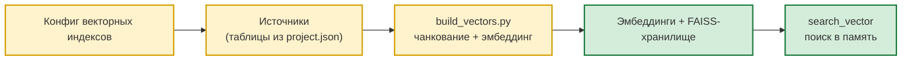

# 🔍 Векторная индексация

> Навигационный индекс каталога `docs/` — в [`README.md`](README.md). Этот документ —
> самодостаточное описание подсистемы.

> **⚠️ Изменение архитектуры (change `remove-vector-index-store`).**
> Persisted FAISS-кеш в `public.agent_vector_index_store` и настройка
> `gateway.vector.index.signature_table` **удалены**. FAISS-индекс собирается
> в памяти из DuckDB-снапшота `<storage_table>` на лету (`provider.preload_indexes`
> при старте gateway). Все упоминания `agent_vector_index_store` /
> `signature_table` ниже — **исторические**, для контекста миграции.
> Современный поток: `oarb.audit_vectors` → `PgDuckDbSyncService` → DuckDB-снапшот
> → `_load_index` (in-memory `IndexFlatIP`). См. `docs/ARCHITECTURE.md`
> § «Vector-инфраструктура» и OpenSpec change
> `openspec/changes/archive/<YYYY-MM-DD-remove-vector-index-store>/`.

> **⚠️ Источник конфигурации индексов.** Конфиг
> векторных индексов живёт в `project.json::gateway.vector.index.indexes.*`
> (`VectorIndexConfig`). PG-реестр `public.agent_vector_index_config` остаётся
> в репозитории как **legacy SQL-артефакт** — `tools/build_vectors.py` и
> `lib/services/cache_provider_impl.py` его **не читают**. Параметры подключения
> к эмбеддеру (base_url, model, dimension, timeout, retries) захардкожены в
> `lib/services/cache_provider_impl.py` (`_EMBED_*`-константы); bearer-токен —
> из переменной окружения `EMBED_TOKEN`. Секция `gateway.vector.embedding`
> в `project.json` удалена.
>
> Ниже часть инструкций (особенно «Как добавить новый индекс», «Как отключить»,
> «Как удалить») всё ещё описывает **PG-реестр**. Эти шаги больше не нужны:
> конфиг правится в `project.json::gateway.vector.index.indexes.<name>`.
> См. CHANGELOG.md → Resource Model Refactoring и `AGENTS.md` → «Configuration».

> **Об именах таблиц и индексов.** Имена `public.agent_vector_index_config`,
> `public.agent_vector_index_store`, `oarb.audit_vectors`, а также имена самих
> индексов (`audits_index`, `violations_index`, …) и исходных таблиц (`oarb.audits`,
> …) — **не зашитые константы**, а значения текущей инсталляции. Они настраиваются
> в `project.json`: `gateway.vector.index.signature_table` /
> `storage_table`, `skills.audit_analyzer.tables[*].name`,
> `skills.audit_analyzer.vector_indexes[*].name`. В других развёртываниях имена
> могут отличаться.

## 🔍 Векторная индексация

> **Исчерпывающий гайд:** как устроены индексы, как их создавать, обновлять,
> добавлять новые, отлаживать, и какие таблицы/файлы задействованы.

### Архитектура



### Таблицы

| Таблица | Назначение | Кто пишет | Кто читает |
|---------|-----------|-----------|-----------|
| `public.agent_vector_index_config` | ⚠️ **Legacy SQL-артефакт.** Кодом **не читается** — конфиг индексов теперь живёт в `project.json::gateway.vector.index.indexes.*`. DDL оставлен в репо для обратной совместимости и исторических ссылок. | — | — |
| `oarb.audit_vectors` | Сырые эмбеддинги `REAL[]` + метаданные (chunk_index/count, content_hash, row_data JSONB, synced_at) | `tools/build_vectors.py` | `lib/services/cache_provider_impl.py:PostgresDuckDbProvider` (агент читает только через DuckDB-снапшот, см. `_resolve_publish_path()`; канон — PG) |
| `public.agent_vector_index_store` | Сериализованный FAISS `BYTEA` + метаданные (dimension, vector_count, updated_at, signature, metric) | `provider.rebuild_and_store_index()` | `provider._load_index()` (in-memory + reload из store) |

DDL: `sql/vectors/create_vector_index_config.sql`, `sql/vectors/create_vector_index_store.sql`, `sql/audit_analyzer/create_oarb_audit_vectors.sql`.

### Дефолтные индексы

В `sql/audit_analyzer/seed_default_indexes.sql` (idempotent):

| index_name | Источник | content_cols | embedding_cols | Чанкование |
|------------|----------|--------------|----------------|------------|
| `audits_index` | `oarb.audits` | `title, audit_type, auditee_entity, status` | те же 4 колонки | нет |
| `violations_index` | `oarb.violations` | `description, recommendation, violation_code, severity` | `description` (chunked 500/80) + `violation_code` | да |
| `audit_reports_index` | `oarb.audit_reports` | `full_text, title, report_number, report_date` | `full_text` (chunked 500/80) + `title` | да |

Применение: `psql "$DATABASE_URL" -f sql/audit_analyzer/seed_default_indexes.sql`

### Шпаргалка: что делать в каком случае

| Цель | Команда | Что происходит |
|------|---------|---------------|
| **Добавить новый индекс** | 1. INSERT в `public.agent_vector_index_config`<br>2. `--index <name> --validate-only` (проверить конфиг)<br>3. `--index <name> --full-rebuild` | Создаётся конфиг, валидируется, собираются вектора + FAISS |
| **Обновить один индекс (новые строки)** | `--index <name>` | Инкрементально: NEW/CHANGED/DELETED по `content_hash` |
| **Обновить один индекс (изменился конфиг)** | UPDATE конфига + `--index <name> --full-rebuild` | TRUNCATE индекса + все строки заново |
| **Проверить корректность конфига индекса (без сборки)** | `--validate-only [--index <name>]` | Pre-flight: существование таблиц/колонок, формат `embedding_cols`, chunk-параметры. Exit 0 — ок, 1 — ошибки |
| **Обновить все индексы (новые строки)** | `build_vectors.py` (без флагов) | Все индексы из конфига, инкрементально |
| **Обновить все индексы (после изменений конфига)** | `--full-rebuild` | Все индексы, TRUNCATE + заново |
| **Проверить что всё актуально (без записей)** | `--check` | Сравнивает сигнатуру, обновляет только diff |
| **Обновить индекс после DDL таблицы** | `--index <name> --full-rebuild` | Схема таблицы изменилась → нужен полный пересчёт |
| **Изменилась модель эмбеддинга** | UPDATE `embedding_*` в `project.json` + `--full-rebuild` | Старые FAISS с неправильной размерностью пересоберутся |
| **Отключить индекс (без удаления данных)** | `UPDATE ... SET enabled = false` | `build_vectors` пропустит, вектора остаются |
| **Удалить индекс полностью** | DELETE из 3 таблиц (`audit_vectors`, `agent_vector_index_store`, `agent_vector_index_config`) | Полное удаление |
| **Удалить все индексы разом** | `TRUNCATE oarb.audit_vectors, public.agent_vector_index_store` + `DELETE FROM public.agent_vector_index_config` | Полная очистка |
| **Восстановить случайно удалённый индекс** | Заново INSERT + `--full-rebuild` | Полная пересборка из источника |
| **Сценарий «один и тот же текст в разных индексах»** | Два индекса с разными `index_name` на одной таблице | Поддерживается, поиск по `index_name` |
| **Embedding провайдер недоступен** | `--check` (быстрее падает), проверить Ollama | Все строки → `errors=N` |
| **Performance для 100k+ строк** | `--batch-size 8 --chunk-size 300` | Меньше памяти Ollama, дольше |

### Как добавить новый индекс

**1. Опишите индекс в `public.agent_vector_index_config`:**

```sql
INSERT INTO public.agent_vector_index_config
    (index_name, source_table, src_table, pk_column,
     content_cols, embedding_cols, track_column, enabled)
VALUES (
    'objects_index',                        -- уникальное имя (= column "source" в audit_vectors / agent_vector_index_store)
    'objects',                              -- короткое имя (идёт в column "table" таблицы audit_vectors)
    'oarb.objects',                         -- полное имя исходной таблицы
    'id',                                   -- колонка первичного ключа
    ARRAY['name', 'description']::TEXT[],   -- колонки для content (отображение в результатах поиска)
    '[
        {"column": "description", "chunk": true, "chunk_size": 500, "chunk_overlap": 80},
        "name"
    ]'::JSONB,                              -- колонки для эмбеддинга (с чанкованием или без)
    'updated_at',                           -- track_column: должен быть monotonic, тип timestamp/bigint
    true
)
ON CONFLICT (index_name) DO UPDATE SET ...;  -- для идемпотентного повторного применения
```

**2. Проверьте конфиг (pre-flight, без сборки):**

```bash
python tools/build_vectors.py --validate-only --index objects_index
# ✓ Конфиг индекса 'objects_index' валиден
```

`--validate-only` проверяет **до** эмбеддинга (ничего не вставляет):
- существование `src_table`, `pk_column`, `track_column` в PG;
- формат `embedding_cols` (массив строк/объектов с `column`);
- существование каждой колонки из `embedding_cols`/`content_cols`;
- корректность `chunk_size`/`chunk_overlap`;
- дубликаты колонок.

При ошибках — exit code 1, каждая ошибка с подсказкой (какие колонки реально есть, как исправить). Без аргумента `--index` проверяет все включённые индексы.

**3. Соберите вектора:**

```bash
# Только новый индекс
python tools/build_vectors.py --index objects_index --full-rebuild

# Или все индексы из конфига
python tools/build_vectors.py --full-rebuild
```

**4. Проверьте FAISS:**

```bash
python tools/build_vectors.py --status
#   objects_index
#     векторов: 100
#     размерность: 1024
#     строк в источнике: 100
#     последняя синхр.: 2026-08-12 ...

psql -c "SELECT source, dimension, vector_count, updated_at FROM public.agent_vector_index_store ORDER BY source"
```

**5. Используйте в CLI:**

```bash
python scripts/cli.py --mode vector --query "объект с нарушениями" --index-name objects_index --top-k 5
```

### Как обновить существующий индекс

#### Сценарий A: новые/изменённые/удалённые строки в источнике (типичный случай)

```bash
# Один индекс — инкрементально (быстро, классификация NEW/CHANGED/DELETED по content_hash)
python tools/build_vectors.py --index audits_index

# Все индексы — инкрементально
python tools/build_vectors.py

# Быстрая проверка: обновить только если сигнатура изменилась (для cron)
python tools/build_vectors.py --check
```

`--check` сравнивает `(count, MAX(track_column))` источника с `oarb.audit_vectors`. Если совпадает — пропускает; если различается — запускает инкрементальную сборку.

**Когда `--check` не помогает:** если меняли `embedding_cols` (сигнатура та же), или добавляли колонку в источник.

#### Сценарий B: изменился список embedding_cols или content_cols

```sql
UPDATE public.agent_vector_index_config
SET embedding_cols = '["title", "description", {"column":"body","chunk":true}]'::jsonb,
    content_cols = ARRAY['title', 'description']::text[],
    updated_at = NOW()
WHERE index_name = 'audits_index';
```

```bash
python tools/build_vectors.py --index audits_index --full-rebuild
# Контент изменился → content_hash другой → все строки пересоздаются
```

**Без `--full-rebuild`** нельзя: `content_hash` изменится для всех строк → `build_vectors` увидит CHANGED → DELETE + INSERT (это эквивалентно `--full-rebuild` для индекса, но медленнее — без TRUNCATE). Используйте `--full-rebuild` явно.

#### Сценарий C: изменилась модель эмбеддинга или размерность

> **⚠️ Параметры эмбеддера захардкожены.** `base_url`, `model`, `dimension`,
> `timeout_sec`, `retries` живут в `lib/services/cache_provider_impl.py`
> (модульные константы `_EMBED_*`). Bearer-токен — `EMBED_TOKEN` env.
> Чтобы сменить модель эмбеддинга — правьте константы и пересоберите.

**Обязательная последовательность:**

```bash
# 1. Удалить старые FAISS — у них неправильная размерность
psql -c "DELETE FROM public.agent_vector_index_store"

# 2. Удалить старые вектора — у них неправильная размерность
psql -c "TRUNCATE oarb.audit_vectors"

# 3. Пересобрать с новой моделью
python tools/build_vectors.py --full-rebuild

# 4. Проверить размерность
python tools/build_vectors.py --status
# dim должен соответствовать новой модели, не 1024
```

**Альтернатива (быстрее, но менее надёжно):** оставить `audit_vectors` без изменений, но тогда `provider.search_vector()` вернёт пустой результат с ошибкой `Размерность индекса не совпадает с размерностью эмбеддинга запроса`. Чистая пересборка безопаснее.

#### Сценарий D: добавилась новая колонка в источнике (DDL)

**Если колонка НЕ используется в embedding_cols** — просто запустите без `--full-rebuild`:

```bash
python tools/build_vectors.py --index audits_index
```

**Если колонка добавляется в embedding_cols** — это сценарий B (UPDATE конфига + `--full-rebuild`).

**Если изменился тип колонки** (varchar→text, bigint→int) — `--full-rebuild` обязателен.

**Если колонка переименована** — старые вектора ссылаются на старое имя через `row_data` (JSONB). В поиске будут видны старые имена; новый `--full-rebuild` обновит.

#### Сценарий E: DDL-изменения в исходной таблице (DROP COLUMN, RENAME, ALTER TYPE)

```bash
# Полная перестройка индекса на этой таблице
python tools/build_vectors.py --index audits_index --full-rebuild
```

**Если `embedding_cols` ссылается на колонку, которой больше нет** — будет ошибка `column "X" does not exist`. Решение: сначала обновите конфиг (`UPDATE public.agent_vector_index_config SET embedding_cols = '[...]'::jsonb WHERE ...`), затем `--full-rebuild`.

**Если DROP COLUMN `track_column`** (`updated_at`) — все индексы на этой таблице перестанут обновляться инкрементально. Решение: добавить новую `updated_at` + обновить конфиг.

#### Сценарий F: исходная таблица пуста (TRUNCATE в источнике)

```bash
# После очистки источника вручную:
psql -c "TRUNCATE oarb.audits"

# build_vectors увидит: source rows = 0, audit_vectors > 0 → все строки DELETED
python tools/build_vectors.py --index audits_index
# Все вектора индекса будут удалены
```

Или принудительно:

```bash
python tools/build_vectors.py --index audits_index --full-rebuild
# TRUNCATE индекса + нет строк для добавления → 0 векторов в индексе
```

#### Сценарий G: добавлен новый индекс (см. «Как добавить новый индекс» выше)

#### Сценарий H: обновить ВСЕ индексы разом

```bash
# Все индексы, инкрементально (без --full-rebuild)
python tools/build_vectors.py

# Все индексы, полная перестройка
python tools/build_vectors.py --full-rebuild

# Все индексы, только проверка сигнатуры
python tools/build_vectors.py --check
```

**Порядок обработки:** `audits_index` → `violations_index` → `audit_reports_index` (по алфавиту `index_name`).

#### Сценарий I: остановить и продолжить обновление (mid-build)

`build_vectors.py` — **идемпотентен**. Если прервать (Ctrl-C) посередине `--full-rebuild`:

```bash
# Что произошло: DELETE FROM oarb.audit_vectors WHERE source = X выполнен
# INSERT выполнен частично
# Что делать:
python tools/build_vectors.py --index X --full-rebuild
# DELETE повторится (безопасно, ничего не изменит), INSERT добьёт
```

**Не нужно:** `TRUNCATE` вручную — `--full-rebuild` уже сделал DELETE.

#### Сценарий J: ошибка во время обновления

См. [Edge cases → Что делать при ошибке посреди --full-rebuild](#что-делать-при-ошибке-посреди---full-rebuild) ниже.

### Как отключить/удалить индекс

#### Отключить (без удаления собранных векторов)

```sql
UPDATE public.agent_vector_index_config SET enabled = false WHERE index_name = 'audits_index';
```

`build_vectors.py` пропустит его при следующем запуске. Вектора остаются в `oarb.audit_vectors` и `public.agent_vector_index_store`.

**Когда использовать:** временно не нужен (например, на время миграции источника), но потом восстановим.

**Что произойдёт в навыке:** `--mode vector --index-name audits_index` **продолжит работать** — провайдер читает FAISS из `agent_vector_index_store`, а не из конфига.

#### Удалить полностью (один индекс)

```sql
-- 1. Удалить собранные вектора (каскадно по source)
DELETE FROM oarb.audit_vectors WHERE source = 'audits_index';
DELETE FROM public.agent_vector_index_store WHERE source = 'audits_index';

-- 2. Удалить конфиг
DELETE FROM public.agent_vector_index_config WHERE index_name = 'audits_index';
```

После этого `python scripts/cli.py --mode vector --index-name audits_index` вернёт **пустой результат** (нет FAISS-индекса). Чтобы восстановить — INSERT конфига + `--full-rebuild`.

**Что НЕ удаляется:**
- Исходная таблица `oarb.audits` — не трогается.
- Другие индексы — не затрагиваются.

#### Удалить все индексы разом (полная очистка)

```sql
-- Все собранные вектора + FAISS + конфиги
TRUNCATE oarb.audit_vectors;
TRUNCATE public.agent_vector_index_store;
TRUNCATE public.agent_vector_index_config CASCADE;
```

После этого `audit_analyze --mode vector` **вернёт ошибку** `unknown_index` (CLI валидирует имя индекса по реестру: `Available indexes: (реестр пуст)`). Восстановление:

```bash
# 1. Применить seed заново
psql -f sql/audit_analyzer/seed_default_indexes.sql

# 2. Пересобрать
python tools/build_vectors.py --full-rebuild
```

#### Удалить один индекс через `TRUNCATE` (быстро, но задевает всё)

**Не рекомендуется** — `TRUNCATE oarb.audit_vectors` без `WHERE` очищает ВСЕ индексы. Если нужно очистить только один:

```sql
-- Найти pk_value, которые принадлежат этому индексу
DELETE FROM oarb.audit_vectors
WHERE source = 'audits_index';

DELETE FROM public.agent_vector_index_store
WHERE source = 'audits_index';
```

Это эквивалентно первому варианту, но с явным указанием колонки. Используйте `DELETE FROM ... WHERE source = X`, а не `TRUNCATE` — без `WHERE` очистите всё.

#### Восстановление (recovery) после случайного удаления

**Если удалили только конфиг (`DELETE FROM agent_vector_index_config`):**

```bash
# 1. Восстановить конфиг (можно взять из бэкапа или из seed_default_indexes.sql)
psql -f sql/audit_analyzer/seed_default_indexes.sql
# Отредактируйте если нужен был другой конфиг

# 2. Вектора и FAISS остались в БД — НЕ пересобирайте, просто проверить
python tools/build_vectors.py --status
# Если FAISS нет — нужно --full-rebuild
```

**Если удалили вектора (`DELETE FROM audit_vectors`):**

```bash
# Вектора потеряны, FAISS остался но невалиден
python tools/build_vectors.py --full-rebuild
# TRUNCATE индекса + полная пересборка
```

**Если `TRUNCATE` всех таблиц:**

```bash
psql -f sql/audit_analyzer/create_oarb_audit_vectors.sql
psql -f sql/audit_analyzer/create_public_agent_predefined_scripts.sql
psql -f sql/vectors/create_vector_index_config.sql
psql -f sql/vectors/create_vector_index_store.sql
psql -f sql/audit_analyzer/seed_default_indexes.sql
python tools/build_vectors.py --full-rebuild
```

#### Что будет если `--index-name` указывает на несуществующий индекс

```bash
python scripts/cli.py --mode vector --query "..." --index-name does_not_exist
# error_type: unknown_index
# "vector index 'does_not_exist' is not registered. Available indexes: ..."
```

Вектора в БД не затрагиваются. Ошибка показывается пользователю.

#### Что будет если удалить индекс, а в `python scripts/cli.py` ссылка

**Если индекс был в реестре предопределённых скриптов (`scripts/predefined/scripts.py` REGISTRY):** скрипты больше не ссылаются на `vector_source` — какой индекс использовать выбирается явно через `--index-name` в `--mode vector`. Удаление индекса из реестра на predefined не влияет.

**Чистый CLI:** `--mode vector --index-name X` с удалённым/несуществующим X — ошибка `unknown_index` (не тихий `[]`): CLI валидирует имя индекса по реестру до `search_vector` (`_resolve_known_index`).

#### Удалить через `psql` cascade (осторожно)

```sql
-- Удалить только конфиг одного индекса (без удаления векторов)
DELETE FROM public.agent_vector_index_config WHERE index_name = 'audits_index';
-- Вектора остаются, но build_vectors не будет их пересобирать
-- (новые строки в источнике не подхватятся — нужен заново INSERT конфига)
```

#### Что удалять нельзя

- `public.agent_vector_index_config` целиком `TRUNCATE ... CASCADE` — удалит все индексы разом (см. выше как восстановить).
- `oarb.audit_vectors` без `WHERE` — удалит ВСЕ вектора всех индексов.
- `public.agent_vector_index_store` без `WHERE` — удалит ВСЕ FAISS-индексы.

Если удалили случайно — см. **«Восстановление после случайного удаления»** выше.

#### Автоматизация удаления в cron / CI

```bash
# Временно отключить индекс (без потери данных)
psql -c "UPDATE public.agent_vector_index_config SET enabled = false WHERE index_name = 'audit_reports_index'"

# Полностью удалить индекс + пересобрать остальные
psql -c "DELETE FROM oarb.audit_vectors WHERE source = 'audit_reports_index'"
psql -c "DELETE FROM public.agent_vector_index_store WHERE source = 'audit_reports_index'"
psql -c "DELETE FROM public.agent_vector_index_config WHERE index_name = 'audit_reports_index'"
python tools/build_vectors.py --full-rebuild  # пересоберёт оставшиеся 2
```

### Алгоритм сборки одного индекса

`tools/build_vectors.py:build_index(index_name, index_cfg, db_table, ...)`:

1. **Загрузить текущее состояние** из `oarb.audit_vectors` по `(source, "table")` → `{pk_value: {synced_at, content_hash, chunk_count}}`.
2. **Прочитать все строки** из исходной таблицы через `SELECT *`.
3. **Посчитать `content_hash`** для каждой строки (MD5 от search_text).
4. **Классифицировать:**
   - **NEW** — строки, которых нет в `audit_vectors` → INSERT
   - **CHANGED** — `content_hash` изменился → DELETE + INSERT
   - **DELETED** — строки, удалённые из источника → DELETE
5. **Разбить на чанки** через `lib/services/text_splitter.py:build_chunks` (только колонки с `chunk: true`).
6. **Батчами отправить в Ollama** (`embedding_base_url` из project.json).
7. **INSERT в `oarb.audit_vectors`** (один INSERT на чанк).
8. **Пересобрать FAISS**: `provider.invalidate_cache(index)` + `provider.rebuild_and_store_index(index, db_table)`.

### Сигнатура индекса и единый путь загрузки

`compute_index_signature()` строит хэш от **канонической конфигурации сборки**
(`src_table`, `pk_column`, `content_cols`, `embedding_cols`, `track_column`,
`chunk_size`, `chunk_overlap`, `metric` + параметры модели эмбеддинга):

- `lib/services/cache_provider_impl.py:compute_index_signature` — считается из реестра
  `public.agent_vector_index_config` (fallback на legacy-чтение до миграции V002);
- `tools/build_vectors.py:_persist_index_build_params` — перед каждой сборкой UPSERT'ит
  **фактические** параметры (`--chunk-size`, `--chunk-overlap`, metric) в реестр, чтобы
  signature всегда отражала реальную сборку;
- `provider.rebuild_and_store_index` пишет `signature` в metadata store.

**Проверка актуальности** (`_check_index_integrity` / `_signature_status`):
сравнение signature сохранённого FAISS с текущей конфигурацией. При расхождении
статус `STALE` (индекс помечается, но **загрузка не блокируется**). Статус изменяется,
когда меняются: `embedding_cols`, `chunk_size`/`chunk_overlap`, `metric`, модель
эмбеддинга, размерность.

**Метрика и нормализация:**

- `metric=cosine` (дефолт) — векторы **нормализуются через `faiss.normalize_L2`**
  при сборке, query — перед поиском; score = косинусное сходство.
- `metric=inner_product` — без нормализации (обратная совместимость со старыми индексами).
- Метрика сохраняется в metadata store и учитывается при загрузке.

**Единый путь `_load_index(index_name)`** (порядок источников):

1. In-memory кэш провайдера (`_index_cache`) — если уже загружен;
2. `public.agent_vector_index_store` (FAISS blob + metadata, проверка signature);
3. Пересборка из сырых векторов `oarb.audit_vectors` → сохранение в store;
4. DuckDB-снапшот (см. `resolve_publish_path()`; default `~/.cache/nanobot/duckdb/cache.duckdb`, override `gateway.cache.local_path`) — fallback;
5. Файлы `.faiss` (legacy).

`search_vector` всегда проходит через `_load_index` — единый путь для кэша, store,
пересборки и fallback'ов (P0-3). Это гарантирует, что поиск и валидация signature
видят один и тот же индекс.

### Параметры конфигурации (public.agent_vector_index_config)

| Поле | Тип | Назначение |
|------|-----|-----------|
| `index_name` | TEXT PK | Уникальное имя индекса (audits_index, violations_index, …). Используется в CLI `--index-name`. |
| `source_table` | TEXT | Короткое имя исходной таблицы (например `audits`, `violations`). Идёт в `column "table"` таблицы `audit_vectors`. |
| `src_table` | TEXT | Полное имя исходной таблицы (`schema.table`). |
| `pk_column` | TEXT | Колонка первичного ключа (по умолч. `id`). |
| `content_cols` | TEXT[] | Колонки для `content` (полный текст для отображения в результатах поиска). |
| `embedding_cols` | JSONB | Колонки для эмбеддинга. Формат: `["col"]` или `[{"column":"col","chunk":true,"chunk_size":500,"chunk_overlap":80}]`. |
| `track_column` | TEXT | Колонка для инкрементальной выборки. Должна быть сравнимой (`>`): `timestamp`, `bigint`. |
| `chunk_size` | INTEGER (V002) | Размер чанка в символах для этой сборки. Часть signature индекса. Дефолт `500`. |
| `chunk_overlap` | INTEGER (V002) | Перекрытие чанков в символах. Часть signature индекса. Дефолт `80`. |
| `metric` | TEXT (V002) | Метрика FAISS: `cosine` (нормализация L2) или `inner_product` (без нормализации). Часть signature индекса. Дефолт `cosine`. |
| `enabled` | BOOLEAN | Активен ли индекс при следующем запуске `build_vectors.py`. |

> **Колонки `chunk_size`/`chunk_overlap`/`metric` добавлены миграцией
> `sql/migrations/V002__vector_chunk_params.sql`** (для уже существующих БД —
> `python tools/migrate.py --apply`). До применения миграции код читает
> конфиг в legacy-режиме без этих полей (см. ниже «Сигнатура индекса»).

### Формат `embedding_cols`

Два варианта в одном массиве (можно смешивать):

```jsonc
// Только имена колонок — простой случай
["title", "audit_type", "status"]

// С чанкованием для длинных текстов
[
  {"column": "description", "chunk": true, "chunk_size": 500, "chunk_overlap": 80},
  "violation_code"
]

// Микс — некоторые с чанкованием, некоторые без
[
  {"column": "full_text", "chunk": true, "chunk_size": 800, "chunk_overlap": 150},
  {"column": "summary", "chunk": false},
  "title"
]
```

**Когда использовать чанкование:**
- Текст >1000 символов → да (по умолчанию chunk_size=500).
- Структурированные поля (код, статус, тип) → нет.
- Короткие тексты (title, summary до 200 символов) → нет (чанки будут по 1).

### Требования к исходной таблице

| Требование | Зачем | Как проверить |
|-----------|-------|---------------|
| Колонка `pk_column` существует | Для `DELETE + INSERT` (upsert) | `SELECT pk FROM table LIMIT 1` |
| Колонка `track_column` монотонна | Для инкрементального опроса | Должна быть `TIMESTAMP` или `BIGINT`, обновляться при UPDATE |
| Все `content_cols` и `embedding_cols` существуют | Для чтения | `SELECT col1, col2 FROM table LIMIT 1` |
| Доступ на `SELECT` | Сборщик должен читать | `GRANT SELECT ON table TO <user>` |
| Доступ на `INSERT`/`DELETE` в `oarb.audit_vectors` | Запись результатов | `GRANT INSERT, DELETE ON oarb.audit_vectors` |
| Доступ на `INSERT`/`UPDATE`/`DELETE` в `public.agent_vector_index_store` | FAISS-сериализация | `GRANT ... ON public.agent_vector_index_store` |

### Алгоритм чанкования

`lib/services/text_splitter.py:build_chunks(row, embedding_cols, chunk_size, chunk_overlap)`:

1. Если **все** колонки короче `chunk_size` → один чанк.
2. Иначе → самая длинная колонка дробится рекурсивно через `split_text()`:
   - Разделители (по приоритету): `\n\n` → `\n` → `.!?` → `,;` → пробел → символ.
   - Чанки склеиваются с перекрытием `chunk_overlap`.
3. В `search_text` каждого чанка добавляется метка `[N/M]`.
4. В `content` (для отображения) добавляется суффикс ` [ч. N/M]`.

**Поведение при поиске:** если несколько чанков одного документа попали в top-K, возвращается только один с наивысшим score, остальные доступны через `matched_chunks`.

### Два режима выдачи в `search_vector`

Метод `CacheProvider.search_vector(query, index_name, top_k, threshold)`
поддерживает **два сценария** через одну и ту же команду.
Метрика — косинусное сходство (по умолчанию, `metric=cosine`),
score в диапазоне `[0.0, 1.0]`, **выше — лучше**:

1. **Топ-K ближайших соседей.** Задаётся через `--top-k N`
   (CLI дефолт `5`, потолок `50`, валидация в `cli.py`).
   Возвращаются **ровно N** ближайших векторов по FAISS, отсортированных
   по убыванию score. Если в индексе много «слабых» совпадений со
   score `0.1–0.3` — они всё равно попадут в выдачу, если других
   ближе нет.

2. **Все результаты выше порога.** Задаётся через `--threshold T`
   (CLI дефолт `0.0` = без фильтра, диапазон `[0.0, 1.0]`).
   Возвращаются **все** вектора с `score >= T`, независимо от их числа.
   Если threshold `0.7`, а в индексе набралось 12 результатов выше
   `0.7` — `search_vector` вернёт 12 строк; если ни одно не набрало —
   пустой список (graceful degradation).

3. **Комбинация.** `--top-k N --threshold T` — сначала фильтр по
   `threshold`, затем top-K из отфильтрованного.
   Итоговый размер: `min(N, count_above_T)`.

| Задача | Рекомендуемый режим | Параметры CLI |
|---|---|---|
| «Покажи первые 5 похожих проверок» | top-K (без threshold) | `--top-k 5` |
| «Найди все нарушения с score не ниже 0.7» | threshold (без top-k) | `--threshold 0.7` |
| «Не больше 10 результатов, но только уверенные» | top-K + threshold | `--top-k 10 --threshold 0.6` |
| Неизвестный score-порог для индекса | top-K (без threshold) | `--top-k 5` — посмотреть распределение score в выдаче и подобрать threshold |

**Примеры** (согласованы с `INTERNAL_API.md` § audit_analyzer CLI):

```bash
# топ-3 по схожести — режим top-K
audit_analyze --mode vector --query 'пожарная безопасность' \
    --index-name audits_index --top-k 3

# все результаты выше порога 0.7 — режим threshold
audit_analyze --mode vector --query 'статусы аудитов' \
    --index-name audits_index --threshold 0.7
```

**Семантика в коде:** параметры читаются из CLI/программного вызова в
`workspace/skills/audit_analyzer/scripts/cli.py:470-474` и передаются
напрямую в `CacheProvider.search_vector(...)` (`lib/services/cache_provider.py:98`).
Реализация FAISS-фильтрации и top-K — в `lib/services/cache_provider_impl.py::search_vector`
и `lib/services/duckdb_cache_store.py::search_vector`. Порядок
применения: **threshold → top_k**.

**Деградация при сбоях:** при сбое эмбеддинга запроса или отсутствии
индекса `search_vector` возвращает пустой список `[]` без падения
(см. § «Graceful degradation в навыке» ниже) — это **намеренное
поведение**, чтобы навык не падал целиком из-за одного запроса.

### Контроль declared vs runtime (tools/check_indexes.py)

В проекте есть **два** источника правды по индексам — это намеренно:

| Источник | Что отвечает |
|---|---|
| `project.json::gateway.vector.index.indexes.*` | **Желаемое состояние**: какие индексы должны быть построены и как (chunk-size, embedding-колонки, metric) |
| `public.agent_vector_index_store` (PG) | **Фактическое состояние**: какие FAISS-blob'ы реально собраны и доступны runtime'у |

**`--list-indexes`** в `audit_analyzer/scripts/cli.py` показывает только runtime
(PG). Чтобы поймать расхождение (declared-but-MISSING / ORPHAN /
STALE / INVALID-signature), есть `tools/check_indexes.py`:

```bash
python tools/check_indexes.py              # текстовый diff
python tools/check_indexes.py --json      # structured (для CI)
```

| Exit | Значение |
|---|---|
| `0` | OK (signature CURRENT) |
| `1` | divergence (MISSING / ORPHAN / STALE / INVALID) |
| `2` | инфраструктурная ошибка (PG недоступна / project.json невалиден) |

Использование: в CI / pre-deploy / после правок `gateway.vector.index.*`,
после `tools/build_vectors.py --rebuild` и т.п. Ловит silent breakage
«объявлен новый индекс в JSON, но FAISS-blob не пересобран».

### Мониторинг

**Статусы через CLI:**

```bash
python tools/build_vectors.py --status
# index_name: vector_count, dimension, src_rows, last_sync
```

**SQL-запросы:**

```sql
-- Сколько векторов в каждом индексе
SELECT source, COUNT(*) AS cnt, MAX(synced_at) AS last
FROM oarb.audit_vectors
GROUP BY source
ORDER BY source;

-- Состояние FAISS-индексов
SELECT source, dimension, vector_count, updated_at
FROM public.agent_vector_index_store
ORDER BY source;

-- Сколько чанков у одного документа (для отладки)
SELECT pk_value, COUNT(*) AS chunks
FROM oarb.audit_vectors
WHERE source = 'violations_index'
GROUP BY pk_value
ORDER BY chunks DESC
LIMIT 10;

-- Вектора без FAISS-индекса (несоответствие)
SELECT v.source, COUNT(*) AS orphan_vectors
FROM oarb.audit_vectors v
LEFT JOIN public.agent_vector_index_store s ON s.source = v.source
WHERE s.source IS NULL
GROUP BY v.source;
```

### Типичные проблемы

#### Ошибки при запуске

| Симптом | Причина | Что делать |
|---------|---------|-----------|
| `ModuleNotFoundError: No module named 'faiss'` | Не установлен `faiss-cpu` | `pip install faiss-cpu numpy` |
| `ModuleNotFoundError: No module named 'numpy'` | Не установлен `numpy` | `pip install numpy` |
| `FAISS-индекс не собран` warning | `faiss` или `numpy` отсутствуют | Установить, перезапустить `--full-rebuild` |
| `ImportError: No module named 'utils'` или `No module named 'lib'` | Скрипт не из корня проекта | Запускать из корня: `cd /path/to/nanobot && python tools/build_vectors.py` |
| `psycopg2.OperationalError: connection refused` | Неверный DSN или PostgreSQL не запущен | Проверьте `channels.postgres.{host,port,user,dbname}` в `project.json` + `DB_PASSWORD` в `.secrets.env`; `pg_isready` |
| `psql: command not found` | Нет `psql` в PATH (только для seed/DDL) | Установите PostgreSQL client или используйте `python -c "from workspace.utils.db import execute; execute(open('sql/...').read())"` |
| `permission denied for table public.agent_vector_index_store` | Не хватает GRANT | `GRANT INSERT, UPDATE, DELETE ON public.agent_vector_index_store TO <user>` |
| `--status` показывает 0 индексов | `public.agent_vector_index_config` пуст | Применить `sql/audit_analyzer/seed_default_indexes.sql` |
| `ERROR: таблица oarb.audit_vectors не создана` | DDL не применён | `psql -f sql/audit_analyzer/create_oarb_audit_vectors.sql` |

#### Ошибки при сборке

| Симптом | Причина | Что делать |
|---------|---------|-----------|
| `TypeError: cannot use 'dict' as a dict key` | `embedding_cols` содержит dict-объекты без нормализации | Уже исправлено в `_normalize_cols()` (`tools/build_vectors.py`); если повторилось — обновите код |
| `column "description" does not exist` | Колонка указана в `embedding_cols`, но отсутствует в источнике | Проверьте `\d oarb.violations`; удалите колонку из конфига или ALTER TABLE |
| `column "updated_at" does not exist` (при `_filter_unchanged`) | `track_column` отсутствует в источнике | Укажите существующую колонку или добавьте `updated_at` через `ALTER TABLE ... ADD COLUMN updated_at TIMESTAMPTZ DEFAULT NOW()` |
| `psycopg2.errors.StringDataRightTruncation` при INSERT | Длина `search_text` > ограничения TEXT | Это не должно происходить (TEXT без лимита); если происходит — `ALTER TABLE oarb.audit_vectors ALTER COLUMN search_text TYPE TEXT` |
| `duplicate key value violates unique constraint` | Параллельный запуск `build_vectors.py` | Запускайте только один экземпляр; для cron используйте flock |
| `httpx.ConnectError: [Errno 111] Connection refused` | Ollama не запущена | `systemctl start ollama` (или запустить вручную); проверить `curl http://localhost:11434` |
| `httpx.HTTPStatusError: 404 Not Found` от Ollama | Модель не загружена | `ollama pull mxbai-embed-large:latest` |
| `httpx.HTTPStatusError: 500 Internal Server Error` | Ollama не справилась с запросом (длинный текст, OOM) | Уменьшите `--batch-size`, разбейте длинные тексты чанками меньшего размера |
| Все строки в `errors`, 0 вставлено | Ollama возвращает ошибку на каждый запрос | Проверьте `ollama logs`; возможно, текст содержит невалидные символы или модель не загружена |
| `Все индексы актуальны, синхронизация не требуется` (а должна быть) | Сигнатура совпадает: `COUNT + MAX(track_column)` одинаковые | Проверьте: `SELECT COUNT(*), MAX(updated_at) FROM oarb.<table>` — если `MAX` старее последнего изменения, добавьте триггер `BEFORE UPDATE` на обновление `updated_at` |
| Бесконечный `Retry N/3 через Nс` | Ollama недоступна, retry безуспешны | Проверьте Ollama; `--check` лучше `--full-rebuild` для cron |
| `Ошибка удаления pk=X` при инкрементальной сборке | Строки были удалены из источника и из `audit_vectors`, но транзакция прервалась | Запустите снова: идемпотентно, дойдёт до консистентного состояния |
| `psycopg2.errors.InvalidTextRepresentation` | Невалидный UTF-8 в строке источника | Очистите данные в источнике: `UPDATE oarb.<table> SET col = regexp_replace(col, '[\\x00-\\x08\\x0B-\\x1F]', '', 'g')` |

#### Проблемы с FAISS-поиском

| Симптом | Причина | Что делать |
|---------|---------|-----------|
| `RuntimeError: Error in faiss::IndexFlat::search: index has 0 vectors` | FAISS-индекс пуст | `python tools/build_vectors.py --status` — если `vector_count=0`, пересоберите `--full-rebuild` |
| `RuntimeError: Error in faiss::IndexFlat::add: dimension mismatch` | Размерность FAISS ≠ размерности эмбеддинга запроса | Модель Ollama изменилась, а `cache_provider_impl` — нет. Обновите `_EMBED_MODEL`/`_EMBED_DIMENSION` в `lib/services/cache_provider_impl.py` и `--full-rebuild` |
| Все результаты с `score=0.000` | FAISS устарел (новые вектора в `audit_vectors` не пересобраны в FAISS) | `python tools/build_vectors.py --full-rebuild` |
| Все результаты возвращают `row_data=None` | Поле `row_data` не пишется в INSERT | Проверьте `INSERT` в `tools/build_vectors.py:476-494`; у вас должна быть колонка `row_data JSONB` |
| Поиск возвращает результаты из другой таблицы | `embedding_cols` конфликтуют между индексами (один и тот же текст в разных таблицах) | Используйте разные `index_name` и проверьте через `SELECT DISTINCT source FROM oarb.audit_vectors` |
| Поиск по `violations_index` возвращает нарушения из всех проверок сразу | Индекс не фильтрует по `audit_id` | По умолчанию семантический поиск не фильтрует; для фильтрации нужен префикс в `--query` (например, `audit_id:5 ...`) — **это расширение, не реализовано** |
| Поиск очень медленный (>1 сек на запрос) | FAISS не в памяти, пересобирается из БД каждый раз | `provider._index_cache` пуст; gateway должен делать `preload_indexes()` при старте |

#### Проблемы с конфигурацией индексов

| Симптом | Причина | Что делать |
|---------|---------|-----------|
| `embedding_cols` содержит `[]` (пустой массив) | Все строки молча игнорируются (нет search_text) | `--validate-only` покажет warning. Заполните: `UPDATE ... SET embedding_cols = '["title"]'::jsonb` |
| `embedding_cols` содержит колонку с NULL для всех строк | `_build_search_text` возвращает `""` → строка пропускается | Проверьте `SELECT col, COUNT(*) FROM table GROUP BY col`; используйте только заполненные колонки |
| `embedding_cols` содержит объект без ключа `"column"` | Ошибка формата (`{"chunk": true}` без имени колонки) | `--validate-only` покажет список доступных колонок. Добавьте `"column": "имя"`: `'[{"column": "description", "chunk": true}]'::jsonb` |
| `embedding_cols`/`pk_column`/`track_column` ссылаются на несуществующие колонки | `column "X" does not exist` при SELECT | `--validate-only` покажет опечатки с подсказкой похожих колонок. Исправьте через UPDATE |
| `content_cols` пуст | INSERT упадёт или `content` будет NULL | `--validate-only` покажет warning. Заполните `content_cols` хотя бы одной колонкой |
| `pk_column` — UUID или TEXT | `pk_value TEXT` в `oarb.audit_vectors` вмещает только строки | Работает из коробки: `pk_value` — TEXT (`BIGINT`/`INTEGER` приводятся через `_norm_pk`); никакого ALTER не нужно |
| `track_column = NULL` для всех строк | `_filter_unchanged` пропускает индекс | Используйте другую track_column или добавьте заполнение: `UPDATE table SET updated_at = NOW() WHERE updated_at IS NULL` |
| В конфиге 2 индекса на одну таблицу с разными `embedding_cols` | Поддерживается, но FAISS общий | Создайте два индекса с разными `index_name`, проверьте через `provider.search_vector(index_name=...)` |
| DROP COLUMN в источнике | `embedding_cols` ссылается на несущую колонку → ошибка чтения | Обновите конфиг: `UPDATE ... SET embedding_cols = '[...]'::jsonb WHERE index_name = '...'` |
| `updated_at` не обновляется при UPDATE | Нет триггера `BEFORE UPDATE` | `CREATE OR REPLACE FUNCTION touch_updated_at() RETURNS TRIGGER AS $$ BEGIN NEW.updated_at = NOW(); RETURN NEW; END $$ LANGUAGE plpgsql; CREATE TRIGGER ... BEFORE UPDATE ON oarb.<table> FOR EACH ROW EXECUTE FUNCTION touch_updated_at();` |

#### Размерность и совместимость моделей

| Модель Ollama | Размерность | По умолчанию в конфиге |
|---------------|-------------|------------------------|
| `mxbai-embed-large:latest` | 1024 | да (дефолт) |
| `nomic-embed-text:latest` | 768 | нет |
| `all-minilm:latest` | 384 | нет |
| `snowflake-arctic-embed:latest` | 1024 | нет |
| `bge-m3` | 1024 | нет |

**Если меняете модель:** правьте модульные константы в `lib/services/cache_provider_impl.py`:

```python
_EMBED_MODEL = "nomic-embed-text:latest"  # было mxbai-embed-large:latest
_EMBED_DIMENSION = 768                     # было 1024
```

После смены **обязательно**:
```bash
# 1. Удалить старые FAISS (они имеют старую размерность)
psql -c "DELETE FROM public.agent_vector_index_store"
psql -c "TRUNCATE oarb.audit_vectors"

# 2. Пересобрать с новой моделью
python tools/build_vectors.py --full-rebuild

# 3. Проверить что размерности совпадают
python tools/build_vectors.py --status
# dim должен быть 768
```

**Если размерность в конфиге не совпадает с реальной Ollama** — FAISS будет собран с правильной размерностью, но `--status` покажет неправильную. Проверяйте вручную:

```bash
curl -X POST http://localhost:11434/api/embed \
     -d '{"model":"<model>","input":["test"]}' | jq '.embeddings[0] | length'
```

### Расширенные сценарии

**Добавить колонку для индексации без пересоздания:**

```sql
UPDATE public.agent_vector_index_config
SET embedding_cols = embedding_cols || '["new_column"]'::jsonb
WHERE index_name = 'audits_index';
```

Затем **обязательно** `--full-rebuild` (т.к. изменился `content_hash` → все строки CHANGED).

**Полная очистка и пересоздание:**

```sql
TRUNCATE oarb.audit_vectors;
TRUNCATE public.agent_vector_index_store;
```

```bash
python tools/build_vectors.py --full-rebuild
```

**Массовое обновление embedding_cols:**

```sql
-- Увеличить размер чанка для всех индексов с чанкованием
UPDATE public.agent_vector_index_config
SET embedding_cols = jsonb_set(
    embedding_cols,
    '{0,chunk_size}',
    '800',
    false
)
WHERE jsonb_typeof(embedding_cols->0) = 'object'
  AND embedding_cols->0->>'column' IN ('description', 'full_text');
```

После — `--full-rebuild` для затронутых индексов.

### Edge cases и редкие сценарии

#### Несколько индексов на одну таблицу

Поддерживается. Например, `audits_summary_index` (только title) и `audits_full_index` (description чанковано):

```sql
INSERT INTO public.agent_vector_index_config (..., index_name, embedding_cols, enabled) VALUES
('audits_summary_index', 'audits', 'oarb.audits', 'id',
 ARRAY['title']::text[],
 '["title"]'::jsonb, 'updated_at', true),
('audits_full_index', 'audits', 'oarb.audits', 'id',
 ARRAY['title','description']::text[],
 '[{"column":"description","chunk":true,"chunk_size":500,"chunk_overlap":80},"title"]'::jsonb,
 'updated_at', true);
```

Поиск: `python scripts/cli.py --mode vector --query "..." --index-name audits_full_index --top-k 5`.

#### Инкрементальная сборка vs `--check` — разница

| Сценарий | Команда | Что делает |
|----------|---------|-----------|
| Быстрая проверка без записей | `python tools/build_vectors.py --check` | Сравнивает сигнатуру `(count, MAX(track))` → запускает инкрементальную сборку только если diff |
| Полная проверка и сборка | `python tools/build_vectors.py` (без флагов) | Загружает все строки, классифицирует NEW/CHANGED/DELETED, собирает |
| Принудительная полная перестройка | `python tools/build_vectors.py --full-rebuild` | TRUNCATE индекса + все строки заново |

**`--check` НЕ помогает, если изменения в embedding_cols** (сигнатура источника не меняется). Используйте `--full-rebuild` или `--index <name> --full-rebuild` после изменения конфига.

**`--check` пропускает индекс если `track_column` NULL** (MAX возвращает NULL → сравнение `0|` с `0|` = совпадение). Используйте непустую track_column.

#### Параллельный запуск (concurrency)

`build_vectors.py` использует `DELETE + INSERT` без блокировок. Параллельный запуск на одном индексе приведёт к:

- `psycopg2.errors.UniqueViolation` на PK `id` (`BIGINT GENERATED BY DEFAULT AS IDENTITY`)
- Потерянным изменениям (один из процессов перезатрёт другого)

**Решения:**

```bash
# Через flock (cron-friendly)
flock -n /var/lock/build_vectors.lock python tools/build_vectors.py --full-rebuild

# Через .pid файл
[ -f /tmp/build_vectors.pid ] && kill -0 $(cat /tmp/build_vectors.pid) 2>/dev/null && exit 1
echo $$ > /tmp/build_vectors.pid
python tools/build_vectors.py --full-rebuild
rm /tmp/build_vectors.pid
```

Параллельная сборка **разных** индексов безопасна (разные `source`).

#### Миграция со старого формата (FAISS-файлы)

Если у вас остались FAISS-индексы в файлах `.faiss` (не в БД) — мигрируйте:

```bash
# 1. Применить новые DDL (если ещё не)
psql -f sql/audit_analyzer/create_oarb_audit_vectors.sql
psql -f sql/vectors/create_vector_index_config.sql
psql -f sql/vectors/create_vector_index_store.sql

# 2. Зарегистрировать индексы в public.agent_vector_index_config
psql -f sql/audit_analyzer/seed_default_indexes.sql

# 3. Пересобрать (старые файлы .faiss будут проигнорированы)
python tools/build_vectors.py --full-rebuild

# 4. Удалить старые файлы
rm -rf ~/.nanobot/workspace/skills/audit_analyzer/cache/*.faiss
```

#### Что делать при ошибке посреди `--full-rebuild`

`--full-rebuild` сначала делает `DELETE FROM oarb.audit_vectors WHERE source = X` (строка 308-316), затем собирает. Если сборка упадёт посередине (например, Ollama недоступна) — индекс окажется в неполном состоянии.

**Решение:**

```bash
# Просто перезапустить — операция идемпотентна:
python tools/build_vectors.py --index audits_index --full-rebuild
# Сначала TRUNCATE, потом заново INSERT
```

**Не нужно:** `TRUNCATE oarb.audit_vectors` — `--full-rebuild` уже делает DELETE перед сборкой.

#### Один и тот же текст в нескольких индексах

Если `oarb.violations.description` индексируется и в `violations_index`, и в `audit_full_index` — FAISS-поиск может вернуть один и тот же документ дважды. **Дедупликация по `pk_value + source`** — ответственность вызывающего кода.

#### Эмбеддинг для разных моделей

Каждый индекс эмбеддится **одной моделью** (из модульных констант `_EMBED_*` в `lib/services/cache_provider_impl.py`). Разные модели для разных индексов **не поддерживаются** — только глобально.

Если нужна разная размерность для разных индексов — нужен рефакторинг `cache_provider_impl.py:PostgresDuckDbProvider` (per-index `embedding_base_url/model`).

#### Обновление без пересборки (in-place)

Если хотите обновить FAISS в памяти после изменения `audit_vectors` без полного пересбора:

```python
from workspace.skills.audit_analyzer.scripts.skill_config import build_cache_provider
provider = build_cache_provider()

# Сбросить in-memory FAISS для одного индекса (перечитает из public.agent_vector_index_store)
provider.invalidate_cache('audits_index')

# Принудительно пересобрать (заново прочитает audit_vectors и сериализует)
provider.rebuild_and_store_index('audits_index', 'oarb.audit_vectors')
```

#### Graceful degradation в навыке

`audit_analyzer` (CLI `--mode vector`) при сбое эмбеддинга возвращает `[]` без падения (в `PostgresDuckDbProvider.search_vector`, `cache_provider_impl.py`):

```python
embedding = get_embedding(query)
if embedding is None:
    self._search_error = "Не удалось получить эмбеддинг запроса."
    return []   # ← здесь
```

Если в логах видите `[vector] Ошибка эмбеддинга после N попыток` — ищите проблему в Ollama, а не в навыке.

#### Большие источники и память Ollama

| Размер источника | `--batch-size` | Время Ollama | Память |
|-----------------|----------------|-------------|--------|
| <1000 строк | 16 (дефолт 10) | минуты | <2 GB |
| 1k–10k строк | 16 | десятки минут | 2–4 GB |
| 10k–100k строк | 8 + `--chunk-size 300` | часы | 4–8 GB |
| >100k строк | 4 + `--chunk-size 200` | дни | 8+ GB |

**Мониторинг во время сборки:**

```bash
# Размер загруженных моделей Ollama
ollama ps

# Логи Ollama (в реальном времени)
journalctl -u ollama -f
```

#### Что если Ollama медленная?

`-chunk-size 200 -batch-size 4 -overlap 50` — снижает нагрузку.

#### Параллельные запуски в gateway

`PgDuckDbSyncService` и `build_vectors.py` могут работать одновременно. Они **не конфликтуют** (разные таблицы: `oarb.audit_vectors` и доменные таблицы аудита), но:

- Если источник (`oarb.audits`) сильно меняется во время `--full-rebuild` — могут появиться пропущенные строки (сигнатура уже посчитана).
- Решение: запускать `build_vectors.py` в период минимальной нагрузки (ночью).

#### Когда `--full-rebuild` медленный

- **Ollama медленная** → уменьшите batch-size.
- **Источник огромный** → запускайте по одному индексу: `--index <name> --full-rebuild`.
- **Сеть до PostgreSQL медленная** → проверьте DSN, используйте локальную БД.
- **Disk I/O на запись в `audit_vectors`** → 100k+ строк = много INSERT; используйте `--batch-size` побольше (32-64) для меньшего числа батчей (но больше памяти Ollama).

#### Когда НЕ нужен `--full-rebuild`

Если добавилась **одна колонка** в источник и она в `embedding_cols` — без `--full-rebuild` строки не пересоберутся (content_hash изменится, но `tools/build_vectors.py` сравнивает по `(source, pk_value)` и content_hash — он увидит diff и обработает). **Проверьте:** добавьте колонку, запустите без `--full-rebuild`, проверьте `audit_vectors.content_hash`.

#### Особые случаи с Ollama моделями

| Проблема | Решение |
|----------|---------|
| Модель `mxbai-embed-large` не поддерживает батчи >32 | `--batch-size 16` (уже дефолт) |
| Модель требует префикс `query:` или `passage:` (ColBERT-style) | Добавьте префикс в `_build_search_text()` перед отправкой |
| Модель возвращает разные размерности для разных текстов | Не поддерживается; проверьте `len(data["embeddings"][0])` — должно быть константой |
| Ollama отвечает `embedding: null` (модель не загружена) | `ollama pull mxbai-embed-large:latest` |
| Ollama требует больше памяти (большие чанки) | Уменьшите `--chunk-size` или `--batch-size` |

#### Совместимость с PostgreSQL 13+

`oarb.audit_vectors.embedding REAL[]` — нативный PostgreSQL массив. Работает на 9.4+. На Greenplum 6.25 — поддерживается.

Если мигрируете на старый PG 9.4 — может потребоваться замена `REAL[]` на `numeric[]` или `double precision[]` (см. DDL).

#### JSONB в Greenplum 6.25

`embedding_cols JSONB` и `row_data JSONB` работают на GP 6+. Если на старом GP (5.x) — нужна миграция на `TEXT`.

#### Безопасность и секреты

`build_vectors.py` использует `DATABASE_URL` через `utils.db.resolve_dsn()` — никаких секретов в коде или логах.

Логи `build_vectors.py` могут содержать **содержимое строк** (превью `content[:60]` в `tools/build_vectors.py:468`) — если источник содержит PII (персональные данные), это утечка. Решение — закомментируйте это превью или обфусцируйте.

#### Когда все сломалось — пересоздание с нуля

```bash
# 1. Удалить конфиг индексов
psql -c "TRUNCATE public.agent_vector_index_config CASCADE"

# 2. Удалить собранные вектора
psql -c "TRUNCATE oarb.audit_vectors"
psql -c "TRUNCATE public.agent_vector_index_store"

# 3. Заново применить seed
psql -f sql/audit_analyzer/seed_default_indexes.sql

# 4. Пересобрать
python tools/build_vectors.py --full-rebuild
```

---

